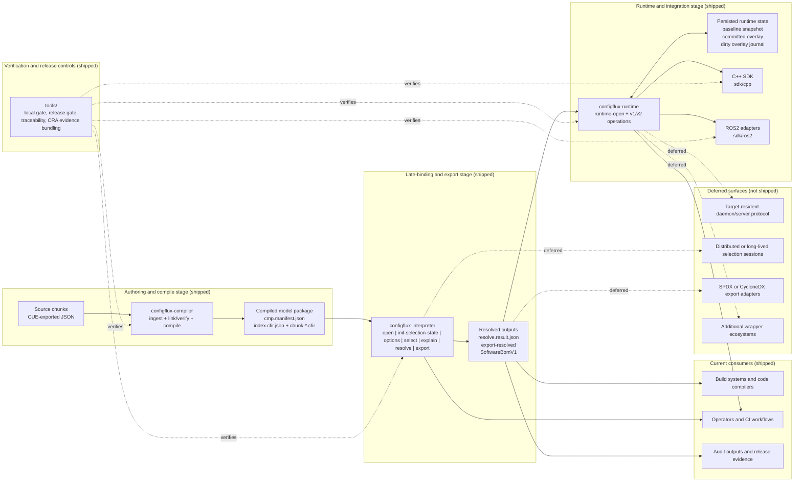
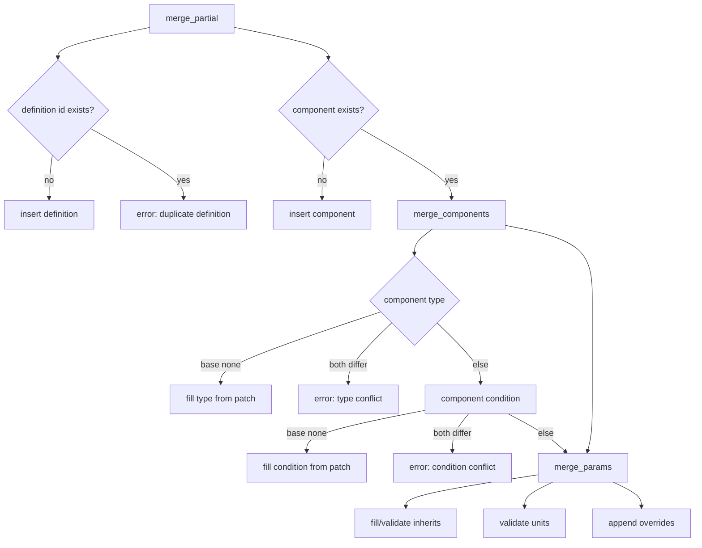

# ConfigFlux Architecture

This document captures the architecture of the configuration compiler and resolver pipeline,
including incremental compilation, scoped resolution, output generation, and runtime handoff.

## Terminology
- Configuration Compiler: application for model ingestion, merge, link/verify, and compiled artifact emission.
- Model Parser/Loader: separate application that runs after compiler stage to load compiled model artifacts and resolve concrete outputs.
- Target Runtime Daemon: target-side central configuration service for efficient CRUD access.
- Code Compiler: language toolchains (for example rustc/clang) that consume generated outputs.
- Wrappers: optional integration layers (for example C++/ROS2), not the product core.

## Goals
- Ingest & Infer: Ingest many decentralized chunks (authored in CUE, exported to JSON) to infer the global "150% model". The configuration model is not an input, but an aggregate graph derived from these chunks.
- Incremental Compilation: Compile source chunks into a hashed Incremental IR (Chunks + Global Index) to support sub-second incremental builds and delta updates.
- Scoped Resolution: Support resolving the 100% model for a specific Target Scope (e.g., a single component or subsystem) rather than forcing a monolithic platform resolution. This enables component-level builds, unit testing, and parallel processing.
- Artifact as Config: Treat "Artifacts" (binaries, drivers, blobs) as first-class configuration parameters. The system validates the logic of artifact selection, leaving physical retrieval to the runtime loader.
- Stateless Resolution: The Resolver accepts the compiled 150% IR and a specific Context (i.e. BOM or scoped BOM) to produce a strict, generic "100% Data Model", without generating language-specific code directly.
- Auditable Output: Emit software BOM and trace metadata that identify exactly what was selected/resolved.

## Product Usage Modes
- Build-time (early binding): generate outputs that influence code compilation (`config.hpp`, macros, build selections).
- Commissioning/production (late binding): in a separate post-compiler stage/application, apply constrained selections and resolve final deployable configuration.
- Runtime loading: the shipped runtime CLI/SDK stack consumes resolved outputs, manages persisted overlays, and serves deterministic local operations; a target-side daemon/server protocol remains deferred.

## Product Ownership and Security Responsibilities
- Configuration Compiler:
  - owns model ingestion, verification, and compiled model emission.
  - does not own post-compile answer orchestration.
- Interpreter (post-compile answer engine):
  - owns CMP-driven answer flows: open/options/select/explain/resolve/export/SBOM.
  - owns command-boundary input validation and deterministic diagnostics behavior.
  - emits evidence-friendly deterministic outputs for audit and traceability.
- Runtime Surface (shipped today):
  - owns the runtime CLI/SDK surface, persisted overlay state, and runtime mutation/sync policies.
  - does not imply a target-side daemon/server protocol.

Out of scope for interpreter productization:
- runtime daemon transport/protocol decisions
- runtime persistence and promotion/sync workflows

## Constraints
- Snake case only for definition IDs, component names, and parameter keys; enforced at ingestion.
- Dependency edges are explicit (e.g., component `depends_on` list) and validated during Link and Verify.
- Shipped product boundary is three application layers with shared model semantics:
  - configuration compiler
  - model parser/loader (`configflux-interpreter`)
  - runtime CLI/SDK stack (`configflux-runtime`, `sdk/cpp`, `sdk/ros2`)
- A target-resident daemon/server protocol remains a deferred extension rather than current shipped scope.
- Canonical model semantics are defined in `docs/model-spec.md`.
- Cross-app contracts are defined in `docs/interface-contracts.md`.
- Canonical software BOM schema is defined in `docs/software-bom-schema.md`.
- Canonical end-to-end example is defined in `docs/canonical-worked-example.md`.

## Current Shipped vs Deferred Architecture
This snapshot reflects the shipped/deferred status as of the current release (see [CHANGELOG.md](../CHANGELOG.md)).
Solid edges are current shipped flows. Dashed edges point to deferred surfaces.



## Target Runtime Daemon (Planned, Deferred)
- Purpose: central configuration source on low-resource targets.
- Scope: load resolved outputs and expose CRUD operations over parameters, artifact references, and metadata.
- Validation: writes must be validated against the configuration model (strong typing and constraints).
- Persistence: state persists across reboot; local-dirty state is tracked for future remote sync/compare and promotion flows.
- Transport/protocol: intentionally open for now; selected later by efficiency constraints.
- Sequencing: implementation is deferred until compiler and parser/loader milestones reach required maturity.

### Loop 10 Runtime Delivery Contract Slice (Implemented Reference API)
Loop 10 implements a reference in-process runtime API in `compiler/src/runtime_api/`
while keeping transport/server protocol decisions deferred.

Input envelope (`runtime_open_request`):
- `schema_version: 1`
- `model_hash: string`
- `resolve_hash: string`
- `scope: string`
- `resolved_output: map<string, resolved_config>`
- `resolved_component_dependencies: map<string, map<string, list<string>>>`
- `resolved_artifacts: map<string, artifact_core>`
- `context_tags: map<string, string>` (optional for strict hash-mismatch checks)
- `choices: map<string, string>` (optional for strict hash-mismatch checks)

Output/CRUD subset (Loop 10 in scope):
- `get_scope_metadata(scope_root)`:
  - returns deterministic scope stats `{ component_count, parameter_count, artifact_count }`.
- `get_parameter(path)`:
  - returns one parameter payload with metadata/value and artifact binding metadata (when applicable).
- `list_parameters(scope_root)`:
  - returns deterministic lexicographically ordered parameter path list.

Validation boundaries:
- runtime envelope hash/model identity mismatch is rejected.
- unknown scope root or parameter path is rejected explicitly.
- parameter updates (if enabled in Loop 10 write-slice) must enforce:
  - type compatibility,
  - lifecycle mutability policy,
  - limits (numeric and length),
  - artifact reference existence for `type = "artifact"`.

Out of scope for Loop 10:
- transport protocol freeze,
- auth/ARBAC enforcement,
- remote sync/promotion workflow,
- distributed runtime sessions,
- persistent conflict merge policy.

Verification strategy seeded for Loop 10:
- contract tests:
  - envelope required fields and deterministic list ordering.
- mutation tests:
  - unknown scope/path, type mismatch, limit violation, lifecycle write rejection.
- determinism tests:
  - repeated read responses are byte-stable for identical runtime state.
- scenario tests:
  - S1 and S3 smoke runtime read-path checks from resolved snapshots.

### Loop 11 Runtime Binary Surface (Implemented)
Loop 11 delivers an executable runtime CLI in `runtime/` over the Loop 10 API slice.

Runtime command surface:
- `runtime-open`
- `get-scope-metadata`
- `list-parameters`
- `get-parameter`
- `set-parameter`

Deterministic transport behavior:
- stdin/stdout JSON mode plus request/response file mode.
- stable exit-code mapping:
  - `0` (`status=ok`)
  - `2` (`status=error`)
  - `1` (transport/parsing/file-I/O failure)
- bounded request size and fail-closed parsing.

Runtime CLI transport diagnostics:
- `E_RUNTIME_CLI_ARGS_INVALID`
- `E_RUNTIME_CLI_REQUEST_IO`
- `E_RUNTIME_CLI_REQUEST_TOO_LARGE`
- `E_RUNTIME_CLI_REQUEST_INVALID`
- `E_RUNTIME_CLI_RESPONSE_IO`

Loop 11 verification coverage:
- RUN matrix `RUN-001` .. `RUN-020` across S1/S2/S3/S4 smoke+medium.
- deterministic replay checks and non-leaky stderr checks.
- full compiler -> interpreter -> runtime chain assertions with hash lineage continuity.

## Core Models
- `schema::Config` (raw, flexible): optional fields, supports partial overlays and recursive overrides.
- `schema::Component`: `type` is optional during ingestion to permit overlays; must be present by resolution time.
- `schema::Parameter`: optional fields, supports `inherits` and `overrides`.
- `schema::Artifact`: a specialized parameter type representing a binary or external resource. It includes metadata (logical name, version, hash, path) but does not contain the binary data itself.
- `resolved_models::ResolvedConfig` / `ResolvedComponent` / `ResolvedParameter`: strict output; required fields enforced (type, value, safety defaults, etc.).

## Compiler Output: The Incremental IR
The Compiler emits an Incremental Object Graph, consisting of:
- IR Chunks: one binary artifact per source file (CUE authored, exported to JSON for ingestion), identified by content hash (SHA256). Contains the localized schema and logic for that component.
- Global Object Index: a manifest mapping logical components to their specific Chunk Hashes.

Benefit: This structure allows for delta processing. When a single source file changes, only its corresponding Chunk is regenerated, and the Global Index is updated. This enables fast incremental builds and delta-based deployment packages.

### Incremental IR Storage (Spec)
IR Chunk (per source file):
- File name: `chunk-<sha256>.cfir` (binary or msgpack; format versioned).
- Payload:
  - `chunk_hash`: sha256 of canonicalized source content.
  - `source_id`: logical source path/ID (string).
  - `components`: partial `schema::Config.components` for that file.
  - `definitions`: partial `schema::Config.definitions` for that file.
  - `artifacts`: partial `schema::Config.artifacts` for that file.
  - `metadata`: optional (timestamp, author, tool version).

Global Object Index:
- File name: `index.cfir.json` (stable, human-readable).
- Fields:
  - `format_version`: integer.
  - `chunks`: list of `{ chunk_hash, source_id }`.
  - `component_index`: map `component_id -> chunk_hash`.
  - `definition_index`: map `definition_id -> chunk_hash`.
  - `artifact_index`: map `artifact_id -> chunk_hash`.
  - `config_hash`: sha256 of sorted index content for cache identity.

Rules:
- A logical ID maps to exactly one chunk; duplicates are errors.
- Chunk hash is computed over canonicalized input (stable key order, normalized whitespace).
- Index is rewritten on any change; resolver uses it to load only required chunks.

## Link and Verify Semantics (Ingestion)
The following describes the current merge rules used during Link and Verify.


Parameter merge (`merge_params`):
- Fills missing `inherits`; errors on conflicting inherit targets.
- Validates unit consistency; errors on conflicts.
- Overwrites value/type/unit/etc. when provided by the patch.
- Appends `overrides` vectors; nested overrides resolved later with context.

Dependency graph:
- Dependency edges are extracted from explicit fields and validated during Link and Verify.
- Implicit dependencies are inferred from references in content (e.g., a parameter that `inherits`
  a definition implies a dependency on that definition).
- Cycle checks run at compile time, before resolution (diamonds are permitted; ADR-0048).

## Resolution (Stateless and Scoped)
The Resolver accepts three inputs:
- 150% IR: the Global Object Index (or a subset of it).
- Context: the BOM/Tags (e.g., variant=heavy).
- Target Scope: a selector defining the root of resolution (e.g., platform:all will generate one config model per top level platform, or components:motor_controller for a unit build; if no more information is provided this will generate all possible motor_controller configs).

### Target Scope Selector (Spec)
Syntax (ASCII):
```
scope        := selector ("," selector)*
selector     := component_selector | platform_selector | all_selector
component_selector := ("component" | "components") ":" ident | "//" ident
platform_selector  := "platform" ":" (ident | "all")
all_selector := "all"
ident        := snake_case identifier (a-z, 0-9, underscore; must start with a-z)
```

Semantics:
- `//name` and `component:name` are equivalent; they select a single component root by ID.
- `components:name` is accepted as an alias for `component:name`.
- `platform:name` selects a component root whose `type` is `platform` and whose ID matches `name`.
- `platform:all` selects all components with `type = "platform"` as independent roots.
- `all` selects the full graph (monolithic resolution) for backwards compatibility.
- If a selector matches no components, resolution fails with an explicit error.
- For multiple selectors, the resolver produces one scoped fragment per root; outputs are keyed by root ID.
- The scoped graph for a root is its transitive dependency closure (via explicit `depends_on` edges),
  filtered by context after closure computation.

Process:
- Load IR: deserialize the 150% model (using the Global Index to find relevant chunks).
- Traverse Scope: start at the Target Scope and identify the transitive closure of dependencies; ignore unconnected parts of the graph.
- Apply Context: evaluate conditions (e.g., variant == 'heavy') against the BOM tags within that closure.
- Prune and Validate: drop disabled components and validate semantic constraints on the remaining tree.

Condition evaluation:
- Uses the in-crate recursive-descent evaluator in
  `compiler/src/conditions.rs` against tags from
  `ResolutionContext`.
- Grammar: Boolean combinations of `ident == '…' | ident != '…'` atoms
  with `&&`, `||`, `!`, and parenthesisation. Single- and double-quoted
  string literals are both accepted. References to missing tags surface
  a `"Failed to evaluate condition"` error except on short-circuited
  branches.

## Resolver Output: The Scoped 100% Model
The Resolver is language-agnostic and emits a Configuration Fragment representing the resolved state of the requested Target Scope.

Format:
- A strict, validated data structure (JSON or binary blob) containing:
  - resolved parameter keys/values
  - artifact references
  - traceability metadata used for software BOM and auditing

Granularity:
- Platform Build: returns the full configuration tree per platform.
- Unit Build: returns a standalone subset containing only the parameters needed for that specific unit.

Usage:
- Consumed by downstream Generators (e.g., CMake templates, Python scripts) to produce language-specific bindings (.hpp, .py) or runtime artifacts (config.db).

## Artifact Handling (The "Linker" Logic)
Artifacts (drivers, libraries, config blobs) are defined in schemas as parameters of type Artifact.

Ingestion:
- The compiler treats them as metadata (path, hash, version). It does not physically validate file existence at build time.

Resolution:
- The resolver ensures the artifact selection is valid (e.g., "Camera=Intel" implies "Artifact=intel_driver.so" is selected).

Output:
- The resolved model provides the application with a Resource Manifest, mapping logical artifact names to concrete identifiers (paths/URIs). The application or Runtime Loader is responsible for fetching/loading these files.

### Artifact Model (Spec)
Current schema:
- `Config.artifacts: HashMap<String, Artifact>` keyed by artifact ID (snake_case).
- `schema::Artifact` fields:
  - `name`: logical name (string)
  - `version`: optional string
  - `hash`: optional string (e.g., sha256)
  - `source`: optional string (app-defined source locator: path/URI/command/etc.)
  - `target`: optional string (app-defined destination locator: path/slot/etc.)
  - `doc`: optional string

Rules:
- At least one of `source` or `target` must be set.
- Artifact parameters use `type = "artifact"` and `value = "<artifact_id>"`; overrides select IDs.

### Artifact Merge Rules (Spec)
- Artifact IDs are unique across chunks; duplicates are errors (no silent overwrite).
- If variants are needed, define multiple artifact IDs and select via overrides on the parameter.

## Dependency Constraints
- The object graph must be directed and acyclic. It may be any DAG — a component
  reachable from a single root via multiple paths (a diamond) is permitted
  (ADR-0048). Only cycles are rejected.
- Dependency edges are explicit and validated during compilation, before resolution.
- Inheritance edges (definitions/parameters) are directed and acyclic; cycles such as A -> B -> A are rejected.
- Conditional compatibility is required: if component A depends on component B, A's enablement
  condition must imply B's enablement condition (A cannot be enabled in any context where B is disabled).

### Dependency Graph Rules (Spec)
Definitions:
- Component graph nodes are components; edges come from explicit `depends_on`.
- Inheritance graph nodes are definitions/parameters; edges come from `inherits`.
- Implicit dependencies from content references (e.g., a component parameter `inherits` a definition)
  add a component -> definition dependency for validation and ordering.

Rules:
- Missing target: any dependency or inheritance reference to an unknown ID is an error.
- Component cycles: any cycle in the component dependency graph is an error.
- Inheritance cycles: any cycle in the inheritance graph is an error.
- Diamond dependencies: for any component root A, two distinct paths from A to the same component D
  (e.g., A -> B -> D and A -> C -> D) are permitted — the component graph may be any DAG (ADR-0048).
- Conditional compatibility: for any component edge A -> B, the condition of A must imply the
  condition of B (treat no condition as `true`). If implication cannot be proven, fail.

### Inheritance Graph Rules (Spec)
Definitions:
- Inheritance nodes are definition IDs and parameter instances that declare `inherits`.
- Edge direction is child -> parent (the `inherits` target).

Rules:
- `inherits` must reference a definition ID; references to components or parameters are invalid.
- Definitions may inherit from definitions; parameters may inherit from definitions only.
- Single parent only (one `inherits` per node).
- Any cycle in the definition inheritance chain is an error (e.g., A -> B -> A).
- Missing target IDs are errors.

### Condition Implication Check (Spec)
Goal:
- Prove that A implies B for any edge A -> B where A and B are component conditions.

Strategy:
1) Syntactic subset check (fast path)
   - Supported grammar: conjunctions of simple comparisons joined by `&&`.
   - Supported atoms: `tag == "value"` and `tag != "value"` (single or double quotes).
   - Rule: A implies B if every atom in B is present in A with the same operator/value.
   - Any unsupported operator (`||`, `<`, `>`, functions) or mixed types exits this path.

2) Eval-driven proof matrix (fallback)
   - Build a finite tag domain from all literal values referenced in conditions,
     unioned with the declared domain of any first-class facet whose name
     matches the tag (ADR-0047: a declared facet's `values` are its full domain,
     including default arms no condition references; an open facet's domain is
     declared ∪ referenced literals).
   - For each tag, include every value in that domain plus a sentinel "other".
   - Evaluate A and B for every Cartesian product assignment of the domain.
   - If any assignment yields A == true and B == false, implication fails.
   - If evaluation cannot be performed (unknown tag, type mismatch), fail closed.

Notes:
- Missing condition is treated as `true`.
- If neither path can prove implication, the compiler errors rather than assume safety.

### Missing Value Policy (Spec)
Rules:
- Definitions may omit `value`; they are metadata templates, not concrete outputs.
- Component parameters must resolve to a concrete value after inheritance and overrides.
- If no override applies and no value is set, resolution fails (no silent drop).
- Values are not inherited from definitions unless explicitly set on the parameter or override.
- Filtered-out components are not validated for missing values.
- Artifact parameters must resolve to a valid artifact ID that exists in `Config.artifacts`.

### Snake Case Enforcement (Spec)
Scope:
- Enforced at ingestion for definition IDs, component IDs, parameter keys, and artifact IDs.

Rules:
- Must match `^[a-z][a-z0-9_]*$`.
- No leading underscore, no double underscores, no uppercase.
- Error on any violation before merge/link to avoid partial state.

Notes:
- `package` and `version` are not snake_case constrained.

## Error Philosophy
- Duplicate definition IDs: error.
- Conflicting component type or condition during merge: error.
- Unit or inherit target conflicts in parameters: error.
- Missing required fields at resolution (component type, parameter type/value): error.
- Condition eval failures: error with the original condition string for debuggability.
- Cyclic dependencies in the object graph: error during Link and Verify (diamonds are permitted; ADR-0048).

## Extension Points
- Additional merge conflict rules (e.g., lifecycle/safety conflicts) can be enforced in `merge_params`.
- Alternative condition evaluators can replace the in-crate evaluator
  if richer typing or policy is needed.
- Generators can consume the scoped 100% model to produce bindings, runtime databases, or artifact manifests.
