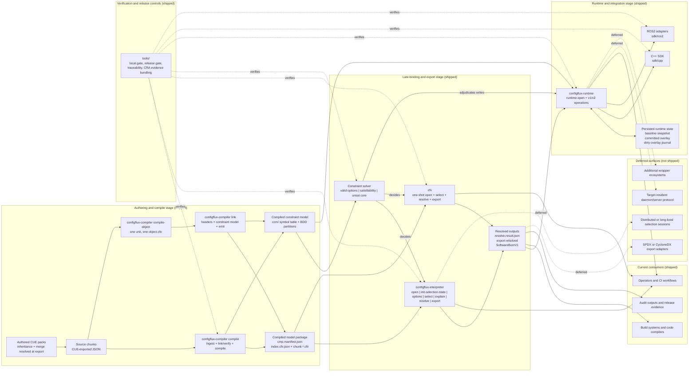
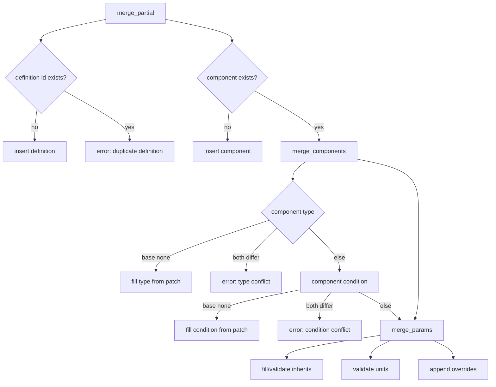

# ConfigFlux Architecture

This document captures the architecture of the configuration compiler, constraint solver, and
resolution pipeline: CUE authoring, incremental compilation, compiled constraint models,
solver-decided selection, scoped resolution, output generation, and runtime handoff.

## Terminology
- Authoring Front End: CUE. Source chunks are authored in CUE and exported to JSON for ingestion; CUE resolves inheritance and pack-level merge before export.
- Configuration Compiler: application for model ingestion, merge, link/verify, and compiled artifact emission.
- Compiled Model Package (CMP): the compiler's data output — manifest, global index, and per-chunk IR.
- Compiled Constraint Model (CCM): the compiler's *logic* output, emitted alongside the CMP — a symbol table mapping facet and option names to solver variables plus a reduced ordered binary decision diagram (BDD) encoding the model's constraints.
- Constraint Solver: the decision engine. Queries the CCM to answer which options remain valid, whether a selection is satisfiable, and why a rejected selection is impossible.
- Model Parser/Loader: separate application that runs after the compiler stage to load compiled model artifacts and resolve concrete outputs.
- Target Runtime Daemon: target-side central configuration service for efficient CRUD access. Deferred — see the deferred-surfaces note below.
- Code Compiler: language toolchains (for example rustc/clang) that consume generated outputs.
- Wrappers: optional integration layers (for example C++/ROS 2), not the product core.

The division of authority across the pipeline is one sentence:

> **The solver decides. The compiler composes.**

The solver adjudicates every selection decision over a modeled facet; the
compiler builds the envelope around that verdict and renders the diagnostics.
Neither substitutes for the other, and neither silently takes over the other's
job when an artifact is missing.

## Goals
- Ingest & Infer: Ingest many decentralized chunks (authored in CUE, exported to JSON) to infer the global "150% model". The configuration model is not an input, but an aggregate graph derived from these chunks.
- Incremental Compilation: Compile source chunks into a hashed Incremental IR (Chunks + Global Index) to support sub-second incremental builds and delta updates. The granularity is the **unit** — the chunks sharing one `package` value, a folder in a monorepo or a whole repository. `compile-object` compiles one unit into a content-addressed object against the headers of the interfaces it depends on, and `link` assembles objects into the package, checking the whole cross-unit graph from those headers before it opens a chunk file. Both ship; a lockfile pins, per unit, the object hash an integration expects. An unchanged unit's object is reused byte for byte, only the edited unit recompiles, and the one-shot `compile` is the same linker fed by in-memory objects, so the two forms cannot disagree.
- Compiled Decision Logic: Compile the model's conditions into a solver-queryable constraint model (the CCM) so selection questions — which options are still valid, is this selection satisfiable, why was it rejected — are answered by a decision procedure rather than by re-interpreting condition strings at query time.
- Scoped Resolution: Support resolving the 100% model for a specific Target Scope (e.g., a single component or subsystem) rather than forcing a monolithic platform resolution. This enables component-level builds, unit testing, and parallel processing.
- Artifact as Config: Treat "Artifacts" (binaries, drivers, blobs) as first-class configuration parameters. The system validates the logic of artifact selection, leaving physical retrieval to the runtime loader.
- Stateless Resolution: Resolution accepts the compiled 150% IR and a specific Context (i.e. BOM or scoped BOM) to produce a strict, generic "100% Data Model", without generating language-specific code directly. Selection state is a caller payload, not hidden session state.
- Auditable Output: Emit software BOM and trace metadata that identify exactly what was selected/resolved.

## Product Usage Modes
- Build-time (early binding): generate outputs that influence code compilation (`config.hpp`, macros, build selections).
- Commissioning/production (late binding): in a separate post-compiler stage/application, apply constrained selections and resolve final deployable configuration.
- Runtime loading: the shipped runtime CLI/SDK stack consumes resolved outputs, manages persisted overlays, and serves deterministic local operations; a target-side daemon/server protocol remains deferred.

## Product Ownership and Security Responsibilities
- Configuration Compiler:
  - owns model ingestion, verification, compiled model emission, and CCM emission.
  - owns composition of resolved envelopes and the rendering of diagnostics.
  - does not own post-compile answer orchestration, and does not adjudicate selection decisions over modeled facets.
  - resolve consults the solver through the shared composition seam for inference; the compiler still composes every byte of the resolved envelope, and imports no solver type.
- Constraint Solver:
  - owns the selection verdict: the valid-option set for a modeled facet, the accept/reject decision on a selection, the satisfiability gate on resolve, the inferred binding when a selection leaves exactly one admissible value for a declared closed facet, and the unsat core behind a rejection.
  - does not own envelope shape, output serialization, or diagnostic wording.
- Interpreter (post-compile answer engine):
  - owns CMP-driven answer flows: open/options/select/explain/resolve/export/SBOM.
  - owns command-boundary input validation and deterministic diagnostics behavior.
  - emits evidence-friendly deterministic outputs for audit and traceability.
- One-shot resolver CLI (`cfx`):
  - presentation only: parses arguments, builds request envelopes, renders results.
  - collapses open → select → resolve → export into a single operator command.
  - holds no decision logic of its own; it reaches the solver through a shared composition seam rather than depending on it directly.
- Runtime Surface (shipped today):
  - owns the runtime CLI/SDK surface, persisted overlay state, and runtime mutation/sync policies.
  - does not imply a target-side daemon/server protocol.

Out of scope for interpreter productization:
- runtime daemon transport/protocol decisions
- runtime persistence and promotion/sync workflows

## Constraints
- Snake case only for definition IDs, component names, parameter keys, artifact IDs, and facet IDs; enforced by the CUE authoring schema. Facet IDs, binding IDs, catalogue IDs and catalogue entry IDs are additionally re-validated by the compiler at ingest, because it interpolates them into the condition clauses it synthesizes and the JSON ingest path never evaluates CUE (ADR-0063). Facet *values* are held to a wider rule at the same point: a non-empty token of letters, digits, `_`, `.` and `-`.
- Dependency edges are explicit (e.g., component `depends_on` list) and validated during Link and Verify.
- Shipped product boundary is four application layers with shared model semantics:
  - configuration compiler
  - model parser/loader (`configflux-interpreter`)
  - one-shot resolver CLI (`cfx`)
  - runtime CLI/SDK stack (`configflux-runtime`, `sdk/cpp`, `sdk/ros2`)
- A usable CCM is a hard precondition for the selection path. `options`, `select`, `resolve`, and `runtime-open` fail closed with a stable diagnostic when no usable solver model is reachable — an empty reference, an unloadable artifact, or a symbol-less stub. There is no availability fallback to a legacy engine, because which engine decided must not be a function of which files happen to be on disk.
- A target-resident daemon/server protocol remains a deferred extension rather than current shipped scope.
- Canonical model semantics are defined in `docs/model-spec.md`.
- Term definitions are in `docs/glossary.md`.
- Cross-app contracts are defined in `docs/interface-contracts.md`.
- Canonical software BOM schema is defined in `docs/software-bom-schema.md`.
- Canonical end-to-end example is defined in `docs/canonical-worked-example.md`.

## Current Shipped vs Deferred Architecture
This snapshot reflects the shipped/deferred status as of the current release (see [CHANGELOG.md](../CHANGELOG.md)).
Solid edges are current shipped flows. Dashed edges point to deferred surfaces.



## Target Runtime Daemon (Planned, Deferred)
- Purpose: central configuration source on low-resource targets.
- Scope: load resolved outputs and expose CRUD operations over parameters, artifact references, and metadata.
- Validation: writes must be validated against the configuration model (strong typing and constraints).
- Persistence: state persists across reboot; local-dirty state is tracked for future remote sync/compare and promotion flows.
- Transport/protocol: intentionally open for now; selected later by efficiency constraints.
- Sequencing: implementation is deferred until compiler and parser/loader milestones reach required maturity.

### Shipped Runtime Surface (In-Process API + CLI)
The runtime ships as an in-process API in `compiler/src/runtime_api/` and an
executable CLI in `runtime/` layered directly over it, with a 1:1
command-to-API mapping. Transport/server protocol decisions stay deferred;
everything below is local and deterministic.

Opening a runtime session takes a resolved snapshot plus its identity: the
model and resolve hashes, the scope, the resolved output and its component
dependencies and artifact bindings, the selection context that produced it
(context tags, explicit choices, and any auto-bound facet defaults), and a
reference to the compiled constraint model. Persisted state — committed
overlay, dirty overlay and its journal, auto-reset policy, sync status, and
the audit log — is carried in the same envelope so a session can be restored
exactly. The authoritative field list lives in
`docs/runtime-cli-contract.md` and `docs/runtime-v2-contract.md`; it is not
duplicated here.

Read operations return deterministic scope statistics, a lexicographically
ordered parameter path list, and individual parameter payloads with their
metadata and artifact binding. Write operations extend to atomic multi-write,
dirty-state inspection and rollback, commit and configuration identity,
auto-reset policy, update check/pull and sync status, event subscription, and
audit export.

Validation boundaries:
- a usable CCM is required at open; a snapshot whose reference is missing or unloadable is rejected rather than opened in a degraded mode.
- runtime envelope hash/model identity mismatch is rejected.
- unknown scope root or parameter path is rejected explicitly.
- parameter writes enforce type compatibility, lifecycle mutability policy, numeric and length limits, and artifact reference existence for `type = "artifact"`.
- a write to a constrained facet is adjudicated by the solver against the same CCM the open validated; a solver fault fails the write rather than silently permitting it.

Transport behavior:
- stdin/stdout JSON mode plus request/response file mode.
- stable exit-code mapping: `0` (`status=ok`), `2` (`status=error`), `1` (transport/parsing/file-I/O failure).
- bounded request size and fail-closed parsing.
- transport diagnostics: `E_RUNTIME_CLI_ARGS_INVALID`, `E_RUNTIME_CLI_REQUEST_IO`, `E_RUNTIME_CLI_REQUEST_TOO_LARGE`, `E_RUNTIME_CLI_REQUEST_INVALID`, `E_RUNTIME_CLI_RESPONSE_IO`.

Still out of scope: transport protocol freeze, auth/ARBAC enforcement,
distributed runtime sessions, and persistent conflict merge policy.

## Core Models
- `schema::Config` (raw, flexible): optional fields, supports partial overlays and recursive overrides.
- `schema::Component`: `type` is optional during ingestion to permit overlays; must be present by resolution time.
- `schema::Parameter`: optional fields, supports recursive `overrides`. It also carries an `inherits` field, but that field is resolved by CUE during whole-pack export — see the inheritance note below.
- `schema::Artifact`: a specialized parameter type representing a binary or external resource. It includes metadata (logical name, version, hash, path) but does not contain the binary data itself.
- `schema::Facet`: a first-class declared selection dimension — an ordered, non-empty, unique value domain with an optional default and an open/closed flag. Facet keys occupy a fourth top-level namespace alongside definitions, components, and artifacts. Declaration is opt-in per facet; an undeclared facet keeps the legacy behavior where its domain is exactly the literals some condition compares it against.
- `resolved_models::ResolvedConfig` / `ResolvedComponent` / `ResolvedParameter`: strict output; required fields enforced (type, value, safety defaults, etc.).
- `loader_api::contracts::SelectionState`, `GetSelectionOptionsResult`, `ResolveResult`: the cross-application contract layer. Canonical field lists are in `docs/model-spec.md` and `docs/interface-contracts.md`.

**Inheritance is authored in CUE, not in TOML.** CUE dereferences `inherits`
during whole-pack export, so the JSON a chunk ingests as already carries
resolved parameters. A hand-written TOML chunk that declares `inherits`
anywhere — including inside a nested `overrides` payload — is rejected at
ingest with a diagnostic naming the offending path. The merge and graph rules
below still describe how inheritance edges are validated, because link/verify
continues to check them; they no longer describe an authoring surface.

## Separate Compilation: Objects and the Link Step
A model can be built one **unit** at a time — a unit being a directory of chunks
that share a `package` value. `compile-object` compiles one unit, against zero
or more interface objects it reads by HEADER only, into a content-addressed
object directory: the unit's chunk files, a deterministic provenance sidecar,
and `object.json`, which carries what the unit exports, what it still needs from
elsewhere, the declarations a sibling unit must be checked against, its clauses
and selectors, and the hashes of the interfaces it was compiled against. An
object holds no constraint model and no package index; those are link products.

`link` turns a set of objects into the package `compile` produces. Its three
stages are documented in `docs/model-spec.md` §6b: the graph checks from headers
alone (unit and id uniqueness, unresolved imports, interface-hash agreement),
the constraint model from those same headers in a canonical clause order, and
the emit. Errors between units gain names at that step — `E_LINK_DUPLICATE_ID`
names both units, `E_LINK_UNRESOLVED_IMPORT` names the unit and the id nothing
declares, `E_LINK_INTERFACE_MISMATCH` names the hash a unit was compiled against
and the one being linked.

**`compile` is the linker fed by in-memory objects.** It groups its `--source`
chunks by `package`, builds one header per unit without writing it, and runs the
same three stages. There is one code path, so the two forms produce
byte-identical packages for every scenario pack and every example — a property
asserted as a test rather than argued.

The payoff is incremental: an unchanged unit's object is reused byte for byte,
only the edited unit recompiles, and the link runs over headers rather than over
every parameter in the model.

## Compiler Output: The Incremental IR
The Compiler emits an Incremental Object Graph, consisting of:
- IR Chunks: one binary artifact per source file (CUE authored, exported to JSON for ingestion), identified by content hash (SHA256). Contains the localized schema and logic for that component.
- Global Object Index: a manifest mapping logical components to their specific Chunk Hashes.
- CMP Manifest: the entry point a loader opens against, binding the model identity to its index and chunk set.

Benefit: This structure allows for delta processing. When a single source file changes, only its corresponding Chunk is regenerated, and the Global Index is updated. This enables fast incremental builds and delta-based deployment packages.

## Compiler Output: The Compiled Constraint Model
Alongside the CMP the compiler emits the CCM into a sibling `ccm/` directory —
the same model's *logic*, compiled for a decision procedure rather than for
data access:
- Symbol table: facet and option names mapped to solver variables. A facet absent from this table is unconstrained by definition, and enumerating it stays a compiler responsibility.
- BDD partitions: the model's constraints as reduced ordered binary decision diagrams, split across partitions with a partition manifest. Declared facet order is significant for symbol emission and diagram layout.
- Provenance sidecar: a deterministic, non-hashed record of the producing tool and the content hashes of the artifacts it accompanies. It sits outside every hash preimage, so it never perturbs model identity.

The loader advertises the CCM location on its model handle, resolved as the
`ccm` directory beside the CMP manifest. Compiling the constraint model at
build time is what lets selection questions be answered by a decision
procedure at query time instead of by re-parsing condition strings per query,
and it is what makes "why was this rejected" answerable as a minimal unsat
core rather than a guess.

### Incremental IR Storage (Spec)
IR Chunk (per source file):
- File name: `chunk-<sha256>.cfir` (binary or msgpack; format versioned).
- Payload:
  - `chunk_hash`: sha256 of the chunk's canonical content (its entity maps); recomputable from the chunk file by any reader.
  - `source_id`: logical source path/ID (string).
  - `components`: partial `schema::Config.components` for that file.
  - `definitions`: partial `schema::Config.definitions` for that file.
  - `artifacts`: partial `schema::Config.artifacts` for that file.
  - `facets`: partial `schema::Config.facets` for that file (a facet is declared by at most one chunk, so the chunk holding a declaration owns it outright).
  - `constraints`: partial `schema::Config.constraints` for that file, carried so the constraint model is readable on the same walk as the facets it names.
  - `catalogues`: partial `schema::Config.catalogues` for that file (declared by at most one chunk, as facets are).
  - `bindings`: partial `schema::Config.bindings` for that file, carried verbatim so a package means exactly what was authored.
  - `metadata`: optional (timestamp, author, tool version).

Global Object Index:
- File name: `index.cfir.json` (stable, human-readable).
- Fields:
  - `format_version`: integer.
  - `chunks`: list of `{ chunk_hash, source_id }`.
  - `component_index`: map `component_id -> chunk_hash`.
  - `definition_index`: map `definition_id -> chunk_hash`.
  - `artifact_index`: map `artifact_id -> chunk_hash`.
  - `facet_index`: map `facet_id -> chunk_hash` (declaration to owning chunk; enters the model identity preimage exactly as the other entity indices do).
  - `catalogue_index`: map `catalogue_id -> chunk_hash` (same rule).
  - `binding_index`: map `binding_id -> chunk_hash` (same rule).
  - `config_hash`: sha256 of sorted index content for cache identity.

Rules:
- A logical ID maps to exactly one chunk; duplicates are errors.
- Chunk hash is computed over canonicalized input (stable key order, normalized whitespace).
- Index is rewritten on any change; resolver uses it to load only required chunks.

## Link and Verify Semantics (Ingestion)
The following describes the current merge rules used during Link and Verify.
These are cross-chunk rules. Within a single authored pack, CUE has already
performed inheritance resolution and pack-level merge before export, and
re-validates the invariants it enforced (see the inheritance note under Core
Models). The principle is CUE authors, the compiler re-validates: no invariant
is trusted merely because the authoring layer promised it.


Parameter merge (`merge_params`):
- Fills missing `inherits`; errors on conflicting inherit targets.
- Validates unit consistency; errors on conflicts.
- Overwrites value/type/unit/etc. when provided by the patch.
- Appends `overrides` vectors; nested overrides resolved later with context.

Dependency graph:
- Dependency edges are extracted from explicit fields and validated during Link and Verify.
- Implicit dependencies are inferred from references in content (e.g., a parameter that `inherits`
  a definition implies a dependency on that definition).
- Cycle checks run at compile time, before resolution (diamonds are permitted; ADR-0048).

## Resolution (Stateless and Scoped)

Resolution is the *composition* half of the pipeline. It does not decide which
selections are legal — the solver already did that — it prunes the 150% model
to the strict 100% output for a selection the solver accepted, and it fails
closed if the selection is unsatisfiable. Selection state is a caller payload
carrying model identity, scope, context tags, and explicit choices; there is no
hidden session state, so the same input always produces the same output and the
same hashes.

Resolution accepts three inputs:
- 150% IR: the Global Object Index (or a subset of it).
- Context: the BOM/Tags (e.g., variant=heavy), plus explicit facet choices.
- Target Scope: a selector defining the root of resolution (e.g., platform:all will generate one config model per top level platform, or components:motor_controller for a unit build; if no more information is provided this will generate all possible motor_controller configs).

Facet defaults are bound at resolve time, not at selection time. An unbound
declared facet that carries a default is auto-bound to it, with precedence
explicit choice > context tag > declared default. The binding is recorded as
first-class provenance in the resolved output and folded into the resolve
identity, so a value that came from a default is distinguishable from the same
value chosen explicitly. A declared facet with no default that an active
condition needs fails resolution, naming the facet and its domain rather than
falling back to a generic unsatisfied-context error.

### Target Scope Selector (Spec)
Syntax (ASCII):
```
scope        := selector ("," selector)*
selector     := component_selector | platform_selector | all_selector
component_selector := ("component" | "components") ":" ident | "//" ident
platform_selector  := "platform" ":" (ident | "all")
all_selector := "all"
ident        := snake_case identifier (a-z, 0-9, underscore; must start with a-z)
```

Semantics:
- `//name` and `component:name` are equivalent; they select a single component root by ID.
- `components:name` is accepted as an alias for `component:name`.
- `platform:name` selects a component root whose `type` is `platform` and whose ID matches `name`.
- `platform:all` selects all components with `type = "platform"` as independent roots.
- `all` selects the full graph (monolithic resolution) for backwards compatibility.
- If a selector matches no components, resolution fails with an explicit error.
- For multiple selectors, the resolver produces one scoped fragment per root; outputs are keyed by root ID.
- The scoped graph for a root is its transitive dependency closure (via explicit `depends_on` edges),
  filtered by context after closure computation.

Process:
- Load IR: deserialize the 150% model (using the Global Index to find relevant chunks).
- Traverse Scope: start at the Target Scope and identify the transitive closure of dependencies; ignore unconnected parts of the graph.
- Apply Context: evaluate conditions (e.g., variant == 'heavy') against the BOM tags within that closure.
- Prune and Validate: drop disabled components and validate semantic constraints on the remaining tree.

Condition evaluation:
- Conditions are parsed once into a typed AST (`ConditionExpr`) and evaluated
  over it. The module is `compiler/src/conditions/` — parser, evaluator,
  rewriter, and implication checker — and evaluation runs against tags from
  `ResolutionContext`.
- Grammar: Boolean combinations of `ident == '…' | ident != '…'` atoms
  with `&&`, `||`, `!`, and parenthesisation. Single- and double-quoted
  string literals are both accepted. References to missing tags surface
  a `"Failed to evaluate condition"` error except on short-circuited
  branches.
- The same typed AST is what the CCM emitter lowers into BDD form, so the
  compiler's condition semantics and the solver's constraint model are two
  readings of one parse, not two independent interpretations of a string.

## Resolver Output: The Scoped 100% Model
The Resolver is language-agnostic and emits a Configuration Fragment representing the resolved state of the requested Target Scope.

Format:
- A strict, validated data structure (JSON or binary blob) containing:
  - resolved parameter keys/values
  - artifact references
  - traceability metadata used for software BOM and auditing

Granularity:
- Platform Build: returns the full configuration tree per platform.
- Unit Build: returns a standalone subset containing only the parameters needed for that specific unit.

Usage:
- Consumed by downstream Generators (e.g., CMake templates, Python scripts) to produce language-specific bindings (.hpp, .py) or runtime artifacts (config.db).

## Artifact Handling (The "Linker" Logic)
Artifacts (drivers, libraries, config blobs) are defined in schemas as parameters of type Artifact.

Ingestion:
- The compiler treats them as metadata (path, hash, version). It does not physically validate file existence at build time.

Resolution:
- The resolver ensures the artifact selection is valid (e.g., "Camera=Intel" implies "Artifact=intel_driver.so" is selected).

Output:
- The resolved model provides the application with a Resource Manifest, mapping logical artifact names to concrete identifiers (paths/URIs). The application or Runtime Loader is responsible for fetching/loading these files.

### Artifact Model (Spec)
Current schema:
- `Config.artifacts: HashMap<String, Artifact>` keyed by artifact ID (snake_case).
- `schema::Artifact` fields:
  - `name`: logical name (string)
  - `version`: optional string
  - `hash`: optional string (e.g., sha256)
  - `source`: optional string (app-defined source locator: path/URI/command/etc.)
  - `target`: optional string (app-defined destination locator: path/slot/etc.)
  - `doc`: optional string

Rules:
- At least one of `source` or `target` must be set.
- Artifact parameters use `type = "artifact"` and `value = "<artifact_id>"`; overrides select IDs.

### Artifact Merge Rules (Spec)
- Artifact IDs are unique across chunks; duplicates are errors (no silent overwrite).
- If variants are needed, define multiple artifact IDs and select via overrides on the parameter.

## Dependency Constraints
- The object graph must be directed and acyclic. It may be any DAG — a component
  reachable from a single root via multiple paths (a diamond) is permitted
  (ADR-0048). Only cycles are rejected.
- Dependency edges are explicit and validated during compilation, before resolution.
- Inheritance edges (definitions/parameters) are directed and acyclic; cycles such as A -> B -> A are rejected.
- Conditional compatibility is required: if component A depends on component B, A's enablement
  condition must imply B's enablement condition (A cannot be enabled in any context where B is disabled).

### Dependency Graph Rules (Spec)
Definitions:
- Component graph nodes are components; edges come from explicit `depends_on`.
- Inheritance graph nodes are definitions/parameters; edges come from `inherits`.
- Implicit dependencies from content references (e.g., a component parameter `inherits` a definition)
  add a component -> definition dependency for validation and ordering.

Rules:
- Missing target: any dependency or inheritance reference to an unknown ID is an error.
- Component cycles: any cycle in the component dependency graph is an error.
- Inheritance cycles: any cycle in the inheritance graph is an error.
- Diamond dependencies: for any component root A, two distinct paths from A to the same component D
  (e.g., A -> B -> D and A -> C -> D) are permitted — the component graph may be any DAG (ADR-0048).
- Conditional compatibility: for any component edge A -> B, the condition of A must imply the
  condition of B (treat no condition as `true`). If implication cannot be proven, fail.

### Inheritance Graph Rules (Spec)
Definitions:
- Inheritance nodes are definition IDs and parameter instances that declare `inherits`.
- Edge direction is child -> parent (the `inherits` target).

Rules:
- `inherits` must reference a definition ID; references to components or parameters are invalid.
- Definitions may inherit from definitions; parameters may inherit from definitions only.
- Single parent only (one `inherits` per node).
- Any cycle in the definition inheritance chain is an error (e.g., A -> B -> A).
- Missing target IDs are errors.

### Condition Implication Check (Spec)
Goal:
- Prove that A implies B for any edge A -> B where A and B are component conditions.

Strategy — one path, not a fast path plus a fallback. Both sides are parsed
into the typed `ConditionExpr` AST and decided by an exhaustive truth-table
search:
- Collect every tag mentioned by an atom on either side, and for each tag the
  set of literal values those atoms compare it against.
- Extend each tag's value set with one fresh sentinel standing for "any other
  value", so "some value nobody wrote down" is represented exactly once.
- Enumerate the Cartesian product of those finite domains. Every assignment is
  *total*, so evaluation is plainly two-valued — there is no missing-tag rung
  to short-circuit over.
- The check fails as soon as one assignment satisfies A while falsifying B;
  that assignment is the counterexample.

This search is logically sound, so it accepts every edge the older syntactic
subset shortcut accepted, plus the cross-operator implications that shortcut
missed. Sentinel selection is deterministic, so the enumerated domains — and
therefore the verdict — are stable for identical inputs.

Notes:
- Missing condition is treated as `true`: a missing consequent is implied by anything, and a missing antecedent is the always-true precondition.
- An unparseable condition surfaces a descriptive parse error rather than a silent verdict.
- If implication cannot be proven, the compiler errors rather than assume safety.
- The domain rule here is deliberately local to the dependency check. Option enumeration is a different question and uses a different domain: for a facet it is the declared domain (an open facet extends it with the literals conditions reference; an undeclared facet has only those literals), which is why a declared default arm no condition mentions is still offered as a valid option.

### Missing Value Policy (Spec)
Rules:
- Definitions may omit `value`; they are metadata templates, not concrete outputs.
- Component parameters must resolve to a concrete value after inheritance and overrides.
- If no override applies and no value is set, resolution fails (no silent drop).
- Values are not inherited from definitions unless explicitly set on the parameter or override.
- Filtered-out components are not validated for missing values.
- Artifact parameters must resolve to a valid artifact ID that exists in `Config.artifacts`.

### Snake Case Enforcement (Spec)
Scope:
- Definition IDs, component IDs, parameter keys, artifact IDs, and facet IDs.

Enforcement point:
- The CUE authoring schema (`compiler/cue/schema.cue`), via the shared `#snakeId`
  constraint applied to each namespace's key type. Authoring-layer enforcement
  means a bad ID is a CUE error at export, before any chunk reaches the compiler.

Rules:
- Must match `^[a-z]([a-z0-9]|_[a-z0-9])*_?$`.
- Must start with a lowercase letter: no leading underscore, no uppercase.
- No consecutive underscores; a single trailing underscore is permitted.

Notes:
- `package` and `version` are not snake_case constrained.
- Because CUE closes each namespace's key type, a non-matching key is rejected as an unknown field rather than merged and flagged later.

## Error Philosophy
- Duplicate definition IDs: error.
- Conflicting component type or condition during merge: error.
- Unit or inherit target conflicts in parameters: error.
- Missing required fields at resolution (component type, parameter type/value): error.
- Condition eval failures: error with the original condition string for debuggability.
- Cyclic dependencies in the object graph: error during Link and Verify (diamonds are permitted; ADR-0048).
- Authored `inherits` in a TOML chunk: error at ingest, naming the offending path.
- No usable constraint model on the selection path: error, never a silent fall back to a different engine.
- A solver fault on a solver-owned query: error. A fault that quietly switches engines is indistinguishable from rot, so it is surfaced rather than absorbed.

## Extension Points
- Additional merge conflict rules (e.g., lifecycle/safety conflicts) can be enforced in `merge_params`.
- Alternative solver backends can sit behind the constraint-model interface; the CCM's on-disk form is versioned so a backend change is a recompile, not a contract break.
- Generators can consume the scoped 100% model to produce bindings, runtime databases, or artifact manifests.
