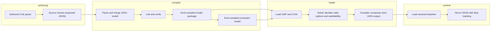
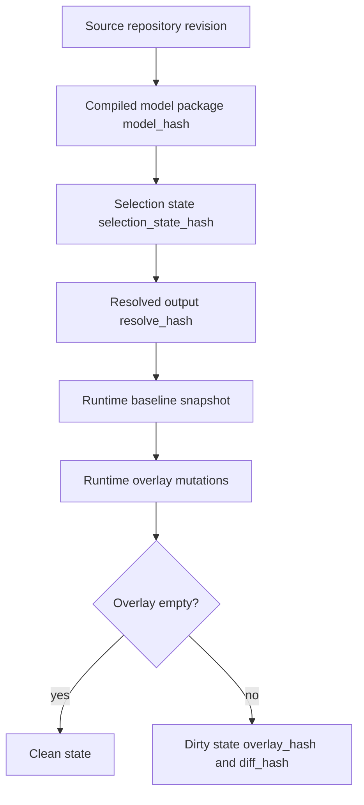

# ConfigFlux Canonical Model Specification

This document defines the complete ConfigFlux data model across the shipped applications:
- Configuration Compiler
- Model Parser/Loader (the late-binding selection and resolve surface)
- Runtime CLI/SDK stack (`runtime`, `sdk/cpp`, `sdk/ros2`)

A target-resident daemon/server *protocol* remains deferred; the runtime
**state model** defined in §9 ships today in the runtime CLI/SDK stack.

It is the single source of truth for model layers, identities, hashes, and lifecycle transitions.

## 1) Scope
- Define the end-to-end model from 150% authoring data to runtime state.
- Define canonical IDs, path addressing, hash semantics, and invariants.
- Keep contracts transport-neutral (CLI, library, RPC wrappers can map to the same model).

Out of scope:
- Protocol-level daemon transport details.
- UI/UX specifics for commissioning tools.

## 2) End-to-End Architecture Model


Authoring is CUE: source chunks are authored as CUE and exported to JSON for
ingestion, and CUE resolves inheritance and pack-level merge before export
(§5). Selection decisions are made by the constraint solver over the compiled
constraint model (CCM); the compiler composes the resolved envelope around the
solver's verdict. A usable CCM is a hard precondition for the selection path —
`options`, `select`, and `resolve` fail closed without one, as does
`runtime-open`.

## 3) Model Layers
| Layer | Owner App | Canonical Artifact | Persistence |
|---|---|---|---|
| Source chunks (150%) | Compiler | CUE sources exported to JSON | Repository |
| Merged in-memory model (150%) | Compiler | `schema::Config` | Process memory |
| Compiled model package (CMP) | Compiler | `cmp.manifest.json` + `index.cfir.json` + `chunk-<hash>.cfir` | Filesystem/object storage |
| Compiled constraint model (CCM) | Compiler | sibling `ccm/` directory (symbol table + BDD) | Filesystem/object storage |
| Selection state | Parser/Loader | `SelectionState` (canonical stateless payload) | Caller payload and optional local session |
| Resolved output (100%) | Parser/Loader | strict resolved payload + metadata envelope | Filesystem/object storage |
| Runtime baseline snapshot | Runtime CLI/SDK | immutable loaded resolved state | Target persistent storage |
| Runtime mutable overlay | Runtime CLI/SDK | local writes delta over baseline | Target persistent storage |

## 4) Canonical Identity and Addressing Model

### 4.1 ID Rules
- `definition_id`, `component_id`, `param_key`, `artifact_id`, `facet_id`, and
  `constraint_id`
  are snake_case, matching `^[a-z]([a-z0-9]|_[a-z0-9])*_?$`. This is enforced
  by the CUE authoring schema (`compiler/cue/schema.cue` `#snakeId`), which
  closes each namespace's key type, so a non-matching key fails at export.
- IDs are globally unique in their namespace.
- Cross-reference targets must exist at verification time.

### 4.2 Cross-Stage Hashes
- `chunk_hash`: sha256 of canonicalized source chunk content.
- `model_hash`: canonical hash identity of the compiled model package (`IrIndex.config_hash`).
- `selection_state_hash`: hash of canonicalized selection state.
- `resolve_hash`: hash identity for one resolved output (`model_hash + scope + context + resolved payload`).
- `overlay_hash`: hash of local mutable runtime overlay.
- `diff_hash`: hash of normalized baseline-vs-overlay diff.

### 4.3 Canonical Runtime Paths
- Parameter path: `component.<component_id>.param.<param_key>`
- Artifact path: `artifact.<artifact_id>.<field>`
- Metadata path: `meta.<key>`

Grammar (informative):
```text
path := component_path | artifact_path | meta_path
component_path := "component." component_id ".param." param_key
artifact_path := "artifact." artifact_id "." field
meta_path := "meta." key
```

## 5) Authoring Model (150%)

Chunks are authored in CUE and exported to JSON for ingestion (ADR-0021). The
type names below are the Rust types in `compiler/src/schema.rs`; the "150%"
label describes the *layer* (the full variability space before selection
prunes it), not a distinct set of types.

```text
Config
- package: string
- version: string
- definitions: map<definition_id, Parameter>
- components: map<component_id, Component>
- artifacts: map<artifact_id, Artifact>
- facets: map<facet_id, Facet>           // first-class facet/domain declarations (ADR-0047)
- constraints: map<constraint_id, Constraint>  // first-class policy assertions (ADR-0054)

Component
- type?: string
- condition?: string
- depends_on: list<component_id>
- params: map<param_key, Parameter>

Parameter
- inherits?: definition_id               // CUE-resolved before export; see below
- type?: string
- unit?: string
- doc?: string
- value?: Value
- lifecycle?: {construction | startup | runtime}
- safety?: {qm | sil1 | sil2 | sil3 | sil4}
- access?: {developer | integrator | technician | supervisor | super_user}
- limits?: Limits
- req_id?: string
- overrides: list<ConditionalBlock>

ConditionalBlock
- condition: string
- payload: Parameter                     // flattened; nested overrides recurse

Artifact
- name: string
- version?: string
- hash?: string
- source?: string
- target?: string
- doc?: string

Facet                                    // ADR-0047; declared in a pack's 00_definitions chunk by convention
- values: list<string>                   // ordered, non-empty, unique — the facet's full domain
- default?: string                       // must be an element of values
- open: bool                             // default false; true = domain is extensible by condition literals
- doc?: string

Constraint                               // ADR-0054; declared alongside facets by convention
- condition: string                      // a Boolean expression over facet values, in the condition grammar
- doc?: string
```

`Value` supports integer, float, boolean, and string.

**`inherits` is not an authorable field in hand-written TOML.** Inheritance is
resolved by CUE during whole-pack export (ADR-0027): the exported JSON a chunk
ingests as carries already-dereferenced parameters. The `inherits` field
survives on `Parameter` because CUE's own `#ResolveParam` shape carries it and
because link/verify still validates inheritance edges, but a TOML chunk that
declares `inherits` anywhere — including inside a nested `overrides` payload —
is **rejected at ingest** with an explicit diagnostic naming the offending
path. Author the chunk in CUE instead.

A **facet** is a first-class, named selection dimension with a declared domain
(ADR-0047). Facet keys occupy a fourth top-level namespace alongside
definitions, components, and artifacts, carry the `snake_case` ID constraint,
and may be declared by at most one chunk (`E_INGEST_DUPLICATE_FACET`). A facet
declaration closes what was previously inferred: prior to ADR-0047 a facet's
domain was implicit — exactly the literals some condition compared it against —
so a default arm that no condition names was unrepresentable. Declaration rules:

- **closed facet** (`open: false`): a condition using a value outside `values`
  is an error (`E_FACET_VALUE_UNDECLARED`).
- **open facet** (`open: true`): condition literals outside `values` extend the
  effective domain (declared ∪ inferred).
- an **undeclared** facet keeps the legacy inferred-domain behavior, so adoption
  is incremental (opt-in per facet) — with one exception: a facet named by a
  `constraint` must be declared (see the constraint rules below).
- `default` must be a member of `values`; `values` must be unique and non-empty
  (re-validated in Rust per the CUE-authors/Rust-revalidates principle,
  ADR-0021).

A **constraint** is a named policy assertion: a Boolean expression over facet
values, carrying an id and an optional `doc` (ADR-0054). Constraint keys occupy
a fifth top-level namespace alongside definitions, components, artifacts, and
facets, and carry the same `snake_case` ID constraint. Constraints are
pack-global — no inheritance, no gap-fill, no merge — and pass through the
resolve layer verbatim, exactly as facets do.

The rule is a single sentence: **every declared constraint must hold in every
resolved configuration.** A constraint is therefore categorically
different from a `condition` on a component, a parameter, or an override: a
condition is an *inclusion selector* that decides what a resolved configuration
contains, while a constraint is a *predicate on the configuration space* that
decides what may be selected at all. The two are held in separate namespaces and
are never merged.

The expression language is the existing condition grammar — a constraint is
parsed by the same parser into the same AST, and ADR-0054 adds no new operator
or evaluator. Declaration rules:

- the expression **must parse**. An unparseable constraint is an ingest error,
  unlike a selector condition, which is skipped and widens no facet: a policy
  that cannot be understood must never be silently dropped.
- every facet a constraint names must be **declared** under `facets`. A
  constraint asserts over a domain; it never creates one, so it does not widen
  a facet's value domain — and a facet that exists only because some condition
  mentions it has no declared domain to assert over. Naming an undeclared facet
  is a compile error, and the remedy is to declare it with its value domain (or
  drop it from the constraint).

  This is the one place where a facet's declaration is a *precondition* rather
  than an opt-in improvement, and the reason is enforceability. Only a declared
  facet gets the intra-facet cardinality clauses that make its values mutually
  exclusive in the compiled model. Without them a constraint that pins a value
  — `arch == 'x86'` — still leaves the sibling value satisfiable, so `cfx
  options` and `cfx select` would keep offering `arch=arm` while `cfx resolve`,
  which evaluates the constraint against a complete assignment, rejected it.
  Rather than accept a policy that only two of the three surfaces enforce, the
  compiler refuses the model. A `condition` over an undeclared facet is
  unaffected; the requirement applies to constraints only.
- every value a constraint names must be a member of a closed facet's declared
  `values` (`E_FACET_VALUE_UNDECLARED`). This is checked for both `==` and
  `!=`: against a closed domain a mistyped `environment != 'prod0'` is not a
  harmless no-op but a tautology that would silently void the policy.

**Enforcement.** Constraints are parsed, validated, carried in the compiled
package, exposed to the loader, and compiled into the CCM (§6) as the model's
**only** authored root conjuncts. A `condition` — on a component, a parameter,
or an override — is never a root conjunct: it contributes its `(facet, value)`
symbols to the variable universe and asserts nothing. That separation is what
makes a rule enforceable without a selector accidentally becoming one.

The consequence is worth stating plainly: **a model that declares no constraints
has no policy.** Its facets still have domains and its `condition`s still decide
what each resolved configuration contains, but every assignment of one value per
facet is selectable and no selection can be refused as a violation. Policy is
something a model opts into by declaring it, never something a selector acquires
by being written a particular way.

Alongside the authored constraints the compiler synthesizes intra-facet
cardinality over every **declared** facet: `exactly_one_of` across a closed
facet's declared values, at-most-one across an open facet's, and nothing at all
for a facet that exists only by inference from some condition. This is what
makes a constraint mean the same thing on the `options` surface as it does under
a concrete resolution — without at-most-one, a rule that positively equates a
facet to a value would still leave its sibling values on the offered list.

Every surface that screens a selection is gated by the compiled constraints, and
they agree. `cfx options` offers a value only if some configuration satisfying
every constraint still contains it. `cfx explain` names the violated constraint
by its id and quotes its condition. `cfx resolve` refuses a violating selection
(`E_SELECTION_CONFLICT`, exit `3`) and writes no snapshot, so a selection
assembled directly — rather than walked out of `options` — is screened too. The
interpreter's `select` verb rejects the same choice with the same
`E_SELECTION_CONFLICT` diagnostic, naming and quoting the constraint, rather
than accepting it and leaving the disagreement to be discovered at resolve.

A core that reduces to synthesized cardinality names no constraint. It is
reported as the model being over-constrained, because cardinality is the model's
own structure rather than a rule anyone authored — attribution is never
satisfied by borrowing the nearest constraint's id.

## 6) Compile-Time Model (CMP and CCM)

Compiler output is a Compiled Model Package, written to `<out>/`:
- `cmp.manifest.json` — the manifest the loader opens against
- `index.cfir.json`
- `chunk-<chunk_hash>.cfir` per source chunk
- `provenance.json` — deterministic, non-hashed sidecar

Alongside it the compiler emits the Compiled Constraint Model in the sibling
directory `<out>/ccm/` — the solver's compiled form of the model's
constraints:
- `ccm.manifest.json`, `ccm.symbols.json` — facet/option names mapped to
  solver variables
- `partition-manifest.json` plus one `partition-NNNN/` subdirectory per
  partition, each carrying a reduced ordered binary decision diagram
  (`ccm.bdd.bin`) and its own manifest and symbol table
- `provenance.json` — deterministic, non-hashed sidecar

The loader advertises the CCM location on its model handle as `ccm_ref`,
resolved as `<cmp_manifest_dir>/ccm`. Selection and resolution require it: see
§7.

Canonical manifest model (`CmpManifest`, from `compiler/src/ir.rs`):
```text
CmpManifest
- schema_version: u32
- model_hash: string
- ir_format_version: u32
- index_ref: string        // default `index.cfir.json`
- chunk_set_ref: string    // default `.`
- config_hash: string
- hash_algo: string        // `sha256`
- canonicalization_version: u32
- created_at: string       // deterministic in v1
- stats?: { source_count, chunk_count, definition_count, component_count, artifact_count }
```

Canonical index model (from `compiler/src/ir.rs`):
```text
IrIndex
- format_version: u32
- chunks: list<{ chunk_hash, source_id }>
- component_index: map<component_id, chunk_hash>
- definition_index: map<definition_id, chunk_hash>
- artifact_index: map<artifact_id, chunk_hash>
- facet_index: map<facet_id, chunk_hash>   // ADR-0047; declaration → owning chunk, enters model_hash preimage
- config_hash: string  // canonical model_hash
```

Canonical chunk model:
```text
IrChunk
- format_version: u32
- chunk_hash: string
- source_id: string
- definitions: map<definition_id, Parameter>
- components: map<component_id, Component>
- artifacts: map<artifact_id, Artifact>
- facets: map<facet_id, Facet>                 // ADR-0047; declarations authored in this chunk
- constraints: map<constraint_id, Constraint>  // ADR-0054; declarations authored in this chunk
- metadata?: json
```

`ir_format_version` / `IrChunk.format_version` is **3**. It is bumped whenever
the emitted chunk shape changes (`1 → 2` ADR-0047 added `facet_index` to the
`model_hash` preimage; `2 → 3` ADR-0054 added `constraints` to the chunk). A
package whose `format_version` does not match is rejected on load rather than
read under the current shape, so a package compiled before a namespace existed
is never mistaken for one that legitimately declares nothing in it.

Required invariants:
- no duplicate IDs across chunks in the same namespace
- index references only known chunks
- chunk content and index mapping agree
- compile/link verification passes before package is considered valid

## 7) Selection Model (Parser/Loader)

Selection is canonicalized as a stateless payload; local stateful sessions are optional convenience.

Type names below are the contract types in
`compiler/src/loader_api/contracts.rs`.

```text
SelectionState
- schema_version: u32
- model_hash: string
- scope: string
- context_tags: map<string, string>
- choices: map<string, string>  // facet -> selected option
- selection_state_hash: string
```

Option query response shape (`GetSelectionOptionsResult`):
```text
GetSelectionOptionsResult
- schema_version: u32
- status: ok | error
- model_hash: string
- scope: string
- facet: string
- valid_options: list<string>
- default?: string                       // declared facet's default arm (skip-if-none)
- declared_open?: bool                   // declared domain openness (skip-if-none)
- pruned_options?: list<{ option: string, reason: string }>
- selection_state_hash: string
- error_count: u32
- warning_count: u32
- diagnostics_ref?: string
- diagnostics: DiagnosticsReport
```

**The solver is the decision authority for a modeled facet.** `valid_options`
for any facet present in the CCM symbol table is the solver's answer, not a
compiler enumeration, and the same holds for the accept/reject verdict on
`select` and the satisfiability gate on `resolve`. The compiler composes the
surrounding envelope and renders diagnostics. Two responsibilities stay
compiler-owned by design, not by fallback: enumerating **unconstrained**
facets (a facet absent from the symbol table has no boolean model), and
non-facet runtime writes such as free-form scalars.

There is no availability fallback. When no usable CCM is reachable — an empty
reference, an unloadable artifact, or a symbol-less stub — `options`,
`select`, and `resolve` fail closed with a stable diagnostic rather than
silently answering from a legacy path, and `runtime-open` enforces the same
precondition when it loads a snapshot. Solver faults on solver-owned queries
surface as faults; a disagreement between engines is reported as an incident
rather than silently resolved. Which engine decided must never be a function
of which files happened to be on disk.

Rules:
- returned options must be valid under current constraints
- invalid options must not be returned as selectable
- same input state must produce same option set and same hashes
- a declared facet's full domain (ADR-0047), including any default arm no
  condition references, appears in `valid_options`; the default is annotated
  (`cfx options` renders `[default: <value>]`)

Facet defaults at resolve time (ADR-0047): an unbound declared facet with a
declared `default` is **auto-bound** to that default during resolution.
Precedence is explicit choice > context tag > declared default. The binding is
recorded as first-class provenance in the resolved output
(`defaulted_choices: map<facet, value>`) and folded into `resolve_hash`
(skip-if-empty, so facet-free models are byte-unchanged). `SelectionState` and
`selection_state_hash` remain **pure user input** — auto-binding is a
resolve-time act, not a mutation of the user's selection. A declared facet with
**no** default that an active condition needs fails resolution with
`E_RESOLVE_FACET_UNBOUND`, naming the facet and its domain (replacing the
generic `E_RESOLVE_CONTEXT_UNSATISFIED` for that case).

## 8) Resolved Model (100%)

Current strict resolved core (from `compiler/src/resolved_models.rs`):
```text
ResolvedConfig
- package: string
- version: string
- components: map<component_id, ResolvedComponent>

ResolvedComponent
- type: string
- params: map<param_key, ResolvedParameter>

ResolvedParameter
- value: Value
- type: string
- unit?: string
- safety: SafetyLevel
- lifecycle: Lifecycle
- access: Role
- req_id?: string
- doc?: string
- limits?: Limits
```

Cross-app resolved envelope (`ResolveResult`, from
`compiler/src/loader_api/contracts.rs`):
```text
ResolveResult
- schema_version: u32
- status: ok | error
- model_hash: string
- scope: string
- selection_state_hash: string
- resolve_hash?: string
- resolved_output?: json                  # map<scope_root, ResolvedConfig>, canonicalized
- context_tags: map<string, string>       # skip-if-empty
- choices: map<facet, option>             # skip-if-empty
- defaulted_choices: map<facet, option>   # declared facets auto-bound to their
                                          # default arm; skip-if-empty
- resolved_component_dependencies: map<scope_root, map<component_id, list<component_id>>>
- resolved_artifacts: map<artifact_id, Artifact>
- error_count: u32
- warning_count: u32
- diagnostics_ref?: string
- diagnostics: DiagnosticsReport
```

Every `skip-if-empty` / `skip-if-none` field above is omitted from the wire
form when empty, so a model that does not exercise a feature stays
byte-identical to one compiled before that feature existed.

`defaulted_choices` is resolve-time provenance: it records exactly the declared
facets (§5) whose resolved value came from the facet's declared default rather
than from a `context_tag` or an explicit `choice` (precedence: explicit choice >
context tag > declared default). It folds into `resolve_hash` with the same
skip-if-empty rule, so a model with no declared facets — or none that defaulted —
leaves the `resolve_hash` pre-image byte-unchanged. It is deliberately absent
from `selection_state_hash`, which stays pure user input: two users, one who
explicitly chose the default and one who left it unset, still hash differently.

Software BOM relation:
- A software BOM is exported from a resolved output and includes:
  - identity linkage (`model_hash`, `resolve_hash`, optional `selection_state_hash`)
  - resolved components/parameters
  - resolved artifact references and metadata
  - parameter binding phase derived from lifecycle:
    - `construction -> early`
    - `startup -> late`
    - `runtime -> runtime`
- Canonical schema is defined in `docs/software-bom-schema.md`.

## 9) Runtime State Model (Shipped)

This model ships today in the runtime CLI and the first-party C++/ROS 2 SDKs
over the runtime C ABI. What remains deferred is a target-resident
daemon/server *transport* — the state model itself, its persistence, and its
dirty-tracking rules are live.

Runtime storage model (baseline + overlay):
```text
RuntimeState
- schema_version: u32
- snapshot_id: string
- baseline_resolve_hash: string
- baseline_model_hash: string
- baseline_data_ref: string
- overlay_entries: map<path, Value>
- overlay_hash: string
- diff_hash: string
- is_dirty: bool
```

Rules:
- baseline snapshot is immutable after load
- writes affect only overlay in v1
- `is_dirty` is true when normalized diff is non-empty
- writes must validate type/shape/constraints against model
- opening a snapshot requires a usable CCM; a constrained facet write is
  adjudicated by the solver against the same CCM the open validated

## 10) Validation and Invariants by Stage
| Stage | Required Invariants |
|---|---|
| Authoring (CUE) | snake_case IDs/keys (`#snakeId`), closed namespaces, inheritance resolution, facet shape, constraint shape |
| Ingestion | parse validity, no `inherits` in an authored TOML chunk, no duplicate `source_id`, no duplicate facet declaration across chunks (`E_INGEST_DUPLICATE_FACET`), no duplicate constraint id across chunks |
| Link/Verify | reference integrity, dependency DAG (any acyclic shape; diamonds permitted per ADR-0048), inheritance cycle checks, condition compatibility, facet invariants (non-empty/unique `values`, `default ∈ values`, closed facet fully covers its condition-referenced values — `E_FACET_VALUE_UNDECLARED`), constraint invariants (expression parses, every named facet is declared under `facets`, every named value is in a closed facet's domain — `E_FACET_VALUE_UNDECLARED`) |
| Resolve | required component type, required parameter type/value, condition evaluation correctness, artifact parameter target exists, declared facets auto-bind to their default (a defaultless declared facet an active condition needs → `E_RESOLVE_FACET_UNBOUND`) |
| Runtime write | canonical path validity, type/limits/unit validation, baseline+overlay consistency, solver adjudication for constrained facet writes |

Verification severity policy:
- structural invalidity is an error (must fail verify)
- unreachable/dead branches are warnings (must not fail verify by themselves)

## 11) Lifecycle and State Transitions


## 12) Scale Envelope and Guardrails
- source repository scale target: up to about 20,000 config files
- resolved target scale: up to about 40,000 parameters
- thousands of valid combinations without precomputing all combinations

Implementation guardrails:
- no full cross-product materialization
- scoped closure loading by default
- deterministic hashes and outputs
- fail closed on conflicts and invalid writes
- no requirement for 128GB-class RAM hosts

## 13) Relationship to Other Docs
- Term definitions (facet, option, CCM, resolve_hash lineage): `docs/glossary.md`
- Architecture and pipeline rationale: `docs/design.md`, `docs/plm-approach.md`
- Application boundary contracts: `docs/interface-contracts.md`
- Software BOM schema: `docs/software-bom-schema.md`
- Canonical worked example: `docs/canonical-worked-example.md`
