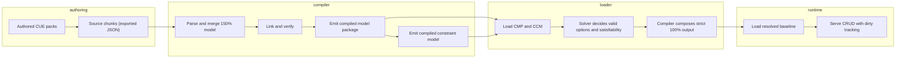
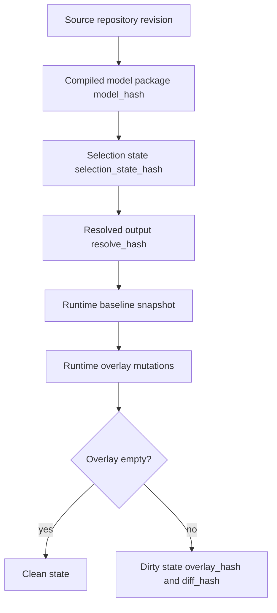

# ConfigFlux Canonical Model Specification

This document defines the complete ConfigFlux data model across the shipped applications:
- Configuration Compiler
- Model Parser/Loader (the late-binding selection and resolve surface)
- Runtime CLI/SDK stack (`runtime`, `sdk/cpp`, `sdk/ros2`)

A target-resident daemon/server *protocol* remains deferred; the runtime
**state model** defined in §9 ships today in the runtime CLI/SDK stack.

It is the single source of truth for model layers, identities, hashes, and lifecycle transitions.

## 1) Scope
- Define the end-to-end model from 150% authoring data to runtime state.
- Define canonical IDs, path addressing, hash semantics, and invariants.
- Keep contracts transport-neutral (CLI, library, RPC wrappers can map to the same model).

Out of scope:
- Protocol-level daemon transport details.
- UI/UX specifics for commissioning tools.

## 2) End-to-End Architecture Model


Authoring is CUE: source chunks are authored as CUE and exported to JSON for
ingestion, and CUE resolves inheritance and pack-level merge before export
(§5). Selection decisions are made by the constraint solver over the compiled
constraint model (CCM); the compiler composes the resolved envelope around the
solver's verdict. A usable CCM is a hard precondition for the selection path —
`options`, `select`, and `resolve` fail closed without one, as does
`runtime-open`.

## 3) Model Layers
| Layer | Owner App | Canonical Artifact | Persistence |
|---|---|---|---|
| Source chunks (150%) | Compiler | CUE sources exported to JSON | Repository |
| Merged in-memory model (150%) | Compiler | `schema::Config` | Process memory |
| Compiled model package (CMP) | Compiler | `cmp.manifest.json` + `index.cfir.json` + `chunk-<hash>.cfir` | Filesystem/object storage |
| Compiled constraint model (CCM) | Compiler | sibling `ccm/` directory (symbol table + BDD) | Filesystem/object storage |
| Selection state | Parser/Loader | `SelectionState` (canonical stateless payload) | Caller payload and optional local session |
| Resolved output (100%) | Parser/Loader | strict resolved payload + metadata envelope | Filesystem/object storage |
| Runtime baseline snapshot | Runtime CLI/SDK | immutable loaded resolved state | Target persistent storage |
| Runtime mutable overlay | Runtime CLI/SDK | local writes delta over baseline | Target persistent storage |

## 4) Canonical Identity and Addressing Model

### 4.1 ID Rules
- `definition_id`, `component_id`, `param_key`, `artifact_id`, `facet_id`, and
  `constraint_id`
  are snake_case, matching `^[a-z]([a-z0-9]|_[a-z0-9])*_?$`. This is enforced
  by the CUE authoring schema (`compiler/cue/schema.cue` `#snakeId`), which
  closes each namespace's key type, so a non-matching key fails at export.
- IDs are globally unique in their namespace.
- Cross-reference targets must exist at verification time.

### 4.2 Cross-Stage Hashes
- `chunk_hash`: sha256 of the chunk's canonical content (its entity maps); recomputable from the chunk file by any reader.
- `model_hash`: canonical hash identity of the compiled model package (`IrIndex.config_hash`).
- `selection_state_hash`: hash of canonicalized selection state.
- `resolve_hash`: hash identity for one resolved output (`model_hash + scope + context + resolved payload`).
- `resolved_output_hash`: hash of the resolved payload alone (`schema_version + scope + resolved_output`); deliberately independent of `model_hash` and of the selection, so it changes only when the bytes a consumer receives change.
- `overlay_hash`: hash of local mutable runtime overlay.
- `diff_hash`: hash of normalized baseline-vs-overlay diff.

### 4.3 Canonical Runtime Paths
- Parameter path: `component.<component_id>.param.<param_key>`
- Requirement-field path (read-only): `component.<component_id>.requires.<slot>.<field>`
- Artifact path: `artifact.<artifact_id>.<field>`
- Metadata path: `meta.<key>`

Grammar (informative):
```text
path := component_path | requires_path | artifact_path | meta_path
component_path := "component." component_id ".param." param_key
requires_path := "component." component_id ".requires." slot_id "." field_id
artifact_path := "artifact." artifact_id "." field
meta_path := "meta." key
```

The two component paths are deliberately separate grammars. Every write verb
accepts `component_path` alone, so "a requirement field is not writable" is a
property of the path parser rather than a check downstream of it; a write to a
`requires_path` is refused with `E_RUNTIME_UNKNOWN_PATH` (§8.1).

## 5) Authoring Model (150%)

Chunks are authored in CUE and exported to JSON for ingestion (ADR-0021). The
type names below are the Rust types in `compiler/src/schema.rs`; the "150%"
label describes the *layer* (the full variability space before selection
prunes it), not a distinct set of types.

```text
Config
- package: string
- version: string                        // a label; reaches config_hash only, never model identity
- definitions: map<definition_id, Parameter>
- components: map<component_id, Component>
- artifacts: map<artifact_id, Artifact>
- facets: map<facet_id, Facet>           // first-class facet/domain declarations (ADR-0047)
- constraints: map<constraint_id, Constraint>  // first-class policy assertions (ADR-0054)
- catalogues: map<catalogue_id, Catalogue>     // typed tables of named entries (ADR-0057)
- bindings: map<binding_id, Binding>           // one shared choice of an entry (ADR-0057)

Component
- type?: string
- condition?: string
- depends_on: list<component_id>
- requires: map<slot_id, Requirement>    // what this component needs from `bindings` (ADR-0057)
- params: map<param_key, Parameter>

Requirement                              // ADR-0057; authored as a bare binding id or the explicit form
- binding: binding_id                    // must name a declared binding
- accepts?: list<entry_id>               // non-empty, unique, a subset of the binding's catalogue; absent = every entry

Parameter
- inherits?: definition_id               // CUE-resolved before export; see below
- type?: string
- unit?: string
- doc?: string
- value?: Value
- facet?: facet_or_binding_id            // ADR-0064; this parameter IS that facet's handle
- lifecycle?: {construction | startup | runtime}
- safety?: {qm | sil1 | sil2 | sil3 | sil4}
- access?: {developer | integrator | technician | supervisor | super_user}
- limits?: Limits
- req_id?: string
- overrides: list<ConditionalBlock>

ConditionalBlock
- condition: string
- payload: Parameter                     // flattened; nested overrides recurse

Artifact
- name: string
- version?: string
- hash?: string
- source?: string
- target?: string
- doc?: string

Facet                                    // ADR-0047; declared in a pack's 00_definitions chunk by convention
- values: list<string>                   // ordered, non-empty, unique — the facet's full domain
- default?: string                       // must be an element of values
- open: bool                             // default false; true = domain is extensible by condition literals
- doc?: string

Constraint                               // ADR-0054; declared alongside facets by convention
- condition: string                      // a Boolean expression over facet values, in the condition grammar
- doc?: string

Catalogue                                // ADR-0057; a typed table of named entries
- fields: map<field_id, CatalogueField>  // non-empty; the table's columns
- entries: map<entry_id, map<field_id, Value>>  // non-empty; every entry supplies exactly the declared fields
- doc?: string

CatalogueField
- type: {integer | float | boolean | string}
- unit?: string
- doc?: string

Binding                                  // ADR-0057; ONE shared choice of a catalogue entry
- catalogue: catalogue_id                // the table whose entry ids are this binding's domain
- default?: entry_id                     // mutually exclusive with derive
- derive?: map<facet_or_binding_id, map<source_value, entry_id>>  // exactly one source; may be partial
- doc?: string
```

`Value` supports integer, float, boolean, and string. A float must be a
**finite** number: `nan`, `inf` and `-inf` are refused at compile time
wherever one can be authored — a parameter's `value`, either `limits` bound, a
nested `overrides` payload, or a catalogue entry field. Canonical JSON cannot
represent them, so the bytes every hash preimage is built from would record
`null` and models differing only in which of the three was written would share
one hash. A CUE-authored pack reaches the compiler as exported JSON, and JSON
has no non-finite literal, so there such a value is refused earlier still, at
parse.

**`inherits` is not an authorable field in hand-written TOML.** Inheritance is
resolved by CUE during whole-pack export (ADR-0027): the exported JSON a chunk
ingests as carries already-dereferenced parameters. The `inherits` field
survives on `Parameter` because CUE's own `#ResolveParam` shape carries it and
because link/verify still validates inheritance edges, but a TOML chunk that
declares `inherits` anywhere — including inside a nested `overrides` payload —
is **rejected at ingest** with an explicit diagnostic naming the offending
path. Author the chunk in CUE instead.

A **facet** is a first-class, named selection dimension with a declared domain
(ADR-0047). Facet keys occupy a fourth top-level namespace alongside
definitions, components, and artifacts, carry the `snake_case` ID constraint,
and may be declared by at most one chunk (`E_INGEST_DUPLICATE_FACET`). A facet
declaration closes what was previously inferred: prior to ADR-0047 a facet's
domain was implicit — exactly the literals some condition compared it against —
so a default arm that no condition names was unrepresentable. Declaration rules:

- **closed facet** (`open: false`): a condition using a value outside `values`
  is an error (`E_FACET_VALUE_UNDECLARED`).
- **open facet** (`open: true`): condition literals outside `values` extend the
  effective domain (declared ∪ inferred).
- an **undeclared** facet keeps the legacy inferred-domain behavior, so adoption
  is incremental (opt-in per facet) — with one exception: a facet named by a
  `constraint` must be declared (see the constraint rules below).
- `default` must be a member of `values`; `values` must be unique and non-empty
  (re-validated in Rust per the CUE-authors/Rust-revalidates principle,
  ADR-0021).

A parameter may declare **`facet: <name>`**, which makes it that facet's
runtime handle (ADR-0064). Name coincidence binds nothing: before this, the
runtime read `component.<id>.param.<key>` as naming facet `<key>`, which is
many-to-one, so two parameters could land on one facet, disagree, and have the
facet silently dropped from the assignment the solver checked a write against.
A declaration replaces that guess. Four rules are checked at compile time, and
all four report the same remedy because an author who reaches any one of them
is declaring a binding for the first time:

- the facet must be **declared** by the model — as a `facets` entry or as a
  binding, which is a facet (`E_FACET_VALUE_UNDECLARED`);
- the parameter's effective **type must be `string`**
  (`E_COMPILE_INPUT_INVALID`), since a facet value is a symbol token. Every arm
  of the override tree is checked, not just the one a given selection activates;
- the parameter must author **no `value` of its own**, and no `overrides` entry
  may set `value` or `facet` (`E_COMPILE_INPUT_INVALID`). Its value is the
  facet's, and an authored one would be a second source of truth. An `overrides`
  entry that varies only OTHER fields — `limits`, `safety`, `access`,
  `lifecycle`, `unit`, `doc` — stays legal, so a bound parameter may still
  tighten its limits under a condition;
- **at most one parameter in the whole model** may bind a given facet
  (`E_COMPILE_INPUT_INVALID`, naming both paths). This is the rule that makes
  the many-to-one mapping impossible by construction. It is checked over the
  complete model, so `compile-object` defers it to `link`, exactly as it defers
  every other cross-unit rule.

Propagation: a bound parameter resolves to the facet's **effective value** — the
explicit choice, else the implied choice, else the declared default — and
carries `facet` into the resolved output so the runtime enforces writes through
the declared binding rather than through a name. A facet with no effective value
leaves the handle unvalued, which is refused exactly as any unvalued parameter
is. A parameter that declares no `facet` is subject to none of this and is
byte-identical on every surface.

A **constraint** is a named policy assertion: a Boolean expression over facet
values, carrying an id and an optional `doc` (ADR-0054). Constraint keys occupy
a fifth top-level namespace alongside definitions, components, artifacts, and
facets, and carry the same `snake_case` ID constraint. Constraints are
pack-global — no inheritance, no gap-fill, no merge — and pass through the
resolve layer verbatim, exactly as facets do.

The rule is a single sentence: **every declared constraint must hold in every
resolved configuration.** A constraint is therefore categorically
different from a `condition` on a component, a parameter, or an override: a
condition is an *inclusion selector* that decides what a resolved configuration
contains, while a constraint is a *predicate on the configuration space* that
decides what may be selected at all. The two are held in separate namespaces and
are never merged.

The expression language is the existing condition grammar — a constraint is
parsed by the same parser into the same AST, and ADR-0054 adds no new operator
or evaluator. Declaration rules:

- the expression **must parse**. An unparseable constraint is an ingest error,
  unlike a selector condition, which is skipped and widens no facet: a policy
  that cannot be understood must never be silently dropped.
- every facet a constraint names must be **declared** under `facets`. A
  constraint asserts over a domain; it never creates one, so it does not widen
  a facet's value domain — and a facet that exists only because some condition
  mentions it has no declared domain to assert over. Naming an undeclared facet
  is a compile error, and the remedy is to declare it with its value domain (or
  drop it from the constraint).

  This is the one place where a facet's declaration is a *precondition* rather
  than an opt-in improvement, and the reason is enforceability. Only a declared
  facet gets the intra-facet cardinality clauses that make its values mutually
  exclusive in the compiled model. Without them a constraint that pins a value
  — `arch == 'x86'` — still leaves the sibling value satisfiable, so `cfx
  options` and `cfx select` would keep offering `arch=arm` while `cfx resolve`,
  which evaluates the constraint against a complete assignment, rejected it.
  Rather than accept a policy that only two of the three surfaces enforce, the
  compiler refuses the model. A `condition` over an undeclared facet is
  unaffected; the requirement applies to constraints only.
- every value a constraint names must be a member of a closed facet's declared
  `values` (`E_FACET_VALUE_UNDECLARED`). This is checked for both `==` and
  `!=`: against a closed domain a mistyped `environment != 'prod0'` is not a
  harmless no-op but a tautology that would silently void the policy.

**Comparing two facets.** A predicate's right-hand side may be an **unquoted
identifier** naming another declared facet, in which case the predicate compares
the two facets' bound values instead of comparing one facet against a constant
(ADR-0057 §D5). `sorter_container == line_container` holds exactly when both are
bound to the same value; `!=` is its negation. A **quoted** right-hand side
keeps its literal meaning, so `container == 'c1'` is unchanged and every model
written before this form existed parses identically.

This is how two independently bound choices are tied together for one
deployment without being merged into one facet: the facets keep separate
domains and separate bindings, and only the constraint requires them to agree.
An unquoted identifier that names nothing declared is a compile error naming it
and suggesting the quotes, because the two readings — another facet, or a
literal the author forgot to quote — are indistinguishable from the text alone.

Both operands must be declared, by the rule above. The comparison means the
pairwise equivalence `AND over v in dom(a) ∪ dom(b) of (a.v ⇔ b.v)`, where a
symbol is read as false for a value its side does not declare. A value only one
side can take is therefore unreachable under `==`: there is nothing on the other
side for it to agree with.

**Enforcement.** Constraints are parsed, validated, carried in the compiled
package, exposed to the loader, and compiled into the CCM (§6) as the model's
**only** authored root conjuncts. A `condition` — on a component, a parameter,
or an override — is never a root conjunct: it contributes its `(facet, value)`
symbols to the variable universe and asserts nothing. That separation is what
makes a rule enforceable without a selector accidentally becoming one.

The consequence is worth stating plainly: **a model that declares no constraints
has no policy.** Its facets still have domains and its `condition`s still decide
what each resolved configuration contains, but every assignment of one value per
facet is selectable and no selection can be refused as a violation. Policy is
something a model opts into by declaring it, never something a selector acquires
by being written a particular way.

Alongside the authored constraints the compiler synthesizes intra-facet
cardinality over every **declared** facet: `exactly_one_of` across a closed
facet's declared values, at-most-one across an open facet's, and nothing at all
for a facet that exists only by inference from some condition. This is what
makes a constraint mean the same thing on the `options` surface as it does under
a concrete resolution — without at-most-one, a rule that positively equates a
facet to a value would still leave its sibling values on the offered list.

Every surface that screens a selection is gated by the compiled constraints, and
they agree. `cfx options` offers a value only if some configuration satisfying
every constraint still contains it. `cfx explain` names the violated constraint
by its id and quotes its condition. `cfx resolve` refuses a violating selection
(`E_SELECTION_CONFLICT`, exit `3`) and writes no snapshot, so a selection
assembled directly — rather than walked out of `options` — is screened too. The
interpreter's `select` verb rejects the same choice with the same
`E_SELECTION_CONFLICT` diagnostic, naming and quoting the constraint, rather
than accepting it and leaving the disagreement to be discovered at resolve.

A core that reduces to synthesized cardinality names no constraint. It is
reported as the model being over-constrained, because cardinality is the model's
own structure rather than a rule anyone authored — attribution is never
satisfied by borrowing the nearest constraint's id.

### Units

A **unit** is a directory of chunks that share one `package` value and are
authored and exported together. A folder inside a monorepo is a unit; a
repository may hold one unit or several. A service is usually one unit, a shared
catalogue is one unit, and the integration that binds everything is one unit.
The `package` field every chunk already carries is the unit's name. Grouping by
that value *is* the definition, so the compiler cross-checks nothing here.

### Catalogues and bindings

A **catalogue** is a typed table: named entries, each supplying every declared
field with a value of the declared type. It is where a shared *thing* lives —
the physical containers a plant uses, the firmware modes a device supports, the
motor variants a line can be built from. A definition describes a parameter's
shape and carries no value; a catalogue carries the values. Any unit may declare
one, and exactly one chunk declares each: a shared unit declares the plant's
containers, a service unit declares the modes its firmware supports and offers
them to the integrator, and the integration unit may declare its own.

Every invariant is enforced at compile time. `fields` and `entries` are
non-empty; every entry supplies exactly the declared fields, no more and no
fewer; every value agrees with its field's declared type, with an integer
accepted for a `float` field and no other promotion; and every `float` value is
finite (`E_CATALOGUE_INVALID`). A catalogue declared by two chunks is
`E_INGEST_DUPLICATE_CATALOGUE`.

A **binding is one shared choice of a catalogue entry**, and semantically it
*is* a declared closed facet whose values are that catalogue's entry ids. It
shares the facet id space, so a binding named like a facet is
`E_INGEST_DUPLICATE_FACET`. Because it is a facet, nothing downstream treats it
specially: an environment binds it in `choices` or `context_tags`, a constraint
references it, `cfx options` lists it as `[closed, default: <entry>]`, `cfx
explain` names rules over it, and the compiled constraint model carries its
`exactly_one_of` cardinality. Two components that name the same binding receive
the same entry by construction — that is how an author says "these must match".

A binding may declare a `default`, or a `derive` table, and never both
(`E_BINDING_INVALID`). A `derive` table is authoring sugar that fixes the entry
from another declared facet or binding — "at factory A it is container 1" —
written as `{source: {source_value: entry_id}}` with exactly one source. The
table may be partial: a source value it does not cover implies nothing. The
catalogue must exist, a `default` must be one of its entries, the source must be
declared, and every key and value in the table must lie in the source's domain
and the catalogue's entries respectively; each failure is `E_BINDING_INVALID`
naming the binding.

Entry ids are ordered id-ascending. The authored form is a CUE struct exported
to a JSON object, and the canonical JSON deliberately does not preserve object
order, so id-ascending is the order the wire format carries — and therefore the
order a binding's domain, the emitted symbols, and `cfx options` all commit to.

### Requirements

A **requirement** is a component's declared need for a binding, named by a slot:

```cue
compute_service: {
    requires: {
        container: "line_container"                                   // any entry will do
        sensor:    {binding: "line_sensor", accepts: ["s1", "s2"]}    // only these two
    }
}
```

A requirement is the only way a component receives a catalogue entry, so a
component that forgets to declare its need has nothing to read and the mistake
cannot be silent. It is **not** a `depends_on` edge: it names a shared choice,
not another component, and it neither joins the dependency closure nor
constrains build order.

`accepts` narrows the binding to the entries this component can actually work
with. Omitting it means every entry is acceptable, which is not the same as an
empty list — a component that accepts nothing can never be satisfied, so an
empty `accepts` is rejected. Every requirement must name a declared binding, and
every accepted entry must be an entry of that binding's catalogue, without
repeats (`E_REQUIRES_INVALID`, naming the component and the slot). Across
components, the `accepts` lists that name one binding must leave at least one
entry standing; when they intersect to nothing the model can never resolve, and
the diagnostic names the binding and every list so the author can see which one
to widen (`E_BINDING_NO_ACCEPTABLE_ENTRY`). All of it is set arithmetic checked
at compile time; no solver is involved.

### Lowering: `derive` and `accepts` become rules with names

Constraints are the model's only *authored* root conjuncts (ADR-0054 §5.1), and
`derive` and `accepts` are policy in disguise. Both are lowered to root
conjuncts, each carrying an attribution id the tools can name:

| authored | lowered conjunct | attribution id |
|---|---|---|
| `derive: {site: {factory_a: c1}}` on binding `line_container` | `site != 'factory_a' \|\| line_container == 'c1'` | `derive:line_container:site=factory_a` |
| `accepts: [c1, c2]` on `compute_service.container` | `any_of(line_container == 'c1', line_container == 'c2')` | `accepts:compute_service.container` |

An `accepts` conjunct on a component that carries a `condition` `C` is emitted
as `!(C) || <accepts>`, so a component that is not included asserts nothing
(ADR-0054 §3). A single-entry list lowers to the bare predicate, which is the
same proposition `any_of` of one disjunct denotes.

The fold order is fixed, because a conjunct's position is its identity in the
compiled model: authored constraints first, then the `derive` conjuncts
(bindings id-ascending, then source values id-ascending), then the `accepts`
conjuncts (components id-ascending, then slots id-ascending). Within one
`accepts` conjunct the disjuncts keep the authored entry order.

The `derive:` and `accepts:` prefixes are **reserved**. An authored constraint
id is snake_case and can never contain `:`, so a lowered id can never collide
with one. `cfx explain` reads the prefix back and reports the authoring
construct rather than the machine implication:

```text
blocked by binding line_container, derived from site: site == 'factory_a' -> 'c1'
blocked by requirement compute_service.container: accepts c1, c2
```

JSON envelopes carry the attribution id verbatim as the constraint id, and a
resolve rejected by one of these rules carries `entity_path`
`constraints/<attribution id>` under the existing `E_SELECTION_CONFLICT` code.

## 6) Compile-Time Model (CMP and CCM)

Compiler output is a Compiled Model Package, written to `<out>/`:
- `cmp.manifest.json` — the manifest the loader opens against
- `index.cfir.json`
- `chunk-<chunk_hash>.cfir` per source chunk
- `provenance.json` — deterministic, non-hashed sidecar

Alongside it the compiler emits the Compiled Constraint Model in the sibling
directory `<out>/ccm/` — the solver's compiled form of the model's
constraints:
- `ccm.manifest.json`, `ccm.symbols.json` — facet/option names mapped to
  solver variables
- `partition-manifest.json` plus one `partition-NNNN/` subdirectory per
  partition, each carrying a reduced ordered binary decision diagram
  (`ccm.bdd.bin`) and its own manifest and symbol table
- `provenance.json` — deterministic, non-hashed sidecar

The loader advertises the CCM location on its model handle as `ccm_ref`,
resolved as `<cmp_manifest_dir>/ccm`. Selection and resolution require it: see
§7.

Canonical manifest model (`CmpManifest`, from `compiler/src/ir.rs`):
```text
CmpManifest
- schema_version: u32
- model_hash: string
- ir_format_version: u32
- index_ref: string        // default `index.cfir.json`
- chunk_set_ref: string    // default `.`
- config_hash: string
- hash_algo: string        // `sha256`
- canonicalization_version: u32
- created_at: string       // deterministic in v1
- stats?: { source_count, chunk_count, definition_count, component_count, artifact_count }
```

Canonical index model (from `compiler/src/ir.rs`):
```text
IrIndex
- format_version: u32
- chunks: list<{ chunk_hash, source_id }>
- component_index: map<component_id, chunk_hash>
- definition_index: map<definition_id, chunk_hash>
- artifact_index: map<artifact_id, chunk_hash>
- facet_index: map<facet_id, chunk_hash>   // ADR-0047; declaration → owning chunk, enters model_hash preimage
- catalogue_index: map<catalogue_id, chunk_hash>  // ADR-0057; enters the model_hash preimage
- binding_index: map<binding_id, chunk_hash>      // ADR-0057; enters the model_hash preimage
- config_hash: string  // canonical model_hash
```

Canonical chunk model:
```text
IrChunk
- format_version: u32
- chunk_hash: string
- source_id: string
- definitions: map<definition_id, Parameter>
- components: map<component_id, Component>
- artifacts: map<artifact_id, Artifact>
- facets: map<facet_id, Facet>                 // ADR-0047; declarations authored in this chunk
- constraints: map<constraint_id, Constraint>  // ADR-0054; declarations authored in this chunk
- catalogues: map<catalogue_id, Catalogue>     // ADR-0057; declarations authored in this chunk
- bindings: map<binding_id, Binding>           // ADR-0057; carried verbatim, `derive` table included
- metadata?: json
```

`ir_format_version` / `IrChunk.format_version` is **4**. It is bumped whenever
the emitted chunk shape changes (`1 → 2` ADR-0047 added `facet_index` to the
`model_hash` preimage; `2 → 3` ADR-0054 added `constraints` to the chunk;
`3 → 4` ADR-0057 added the `catalogues` and `bindings` namespaces to the chunk
and their two indices to the `model_hash` preimage). A package whose
`format_version` does not match is rejected on load rather than read under the
current shape, so a package compiled before a namespace existed is never
mistaken for one that legitimately declares nothing in it.

Required invariants:
- no duplicate IDs across chunks in the same namespace
- index references only known chunks
- chunk content and index mapping agree
- compile/link verification passes before package is considered valid

## 6b) Objects

A model can be built one **unit** at a time. A unit is a directory of chunks
that share a `package` value; that value is the unit's name. `compile-object`
compiles one unit, on its own, into an **object**:

```text
<name>.cfo/
  object.json          the header
  chunk-<hash>.cfir    one per source chunk, byte-identical to the package's copy
  provenance.json      deterministic, non-hashed sidecar
```

An object holds no constraint model and no package index. Those are products of
the link step, which combines objects into a Compiled Model Package.

A unit is compiled against zero or more **interface objects**, passed with
`--interface`. An interface object is not a separate kind of thing: it is an
object whose unit declares definitions, facets, catalogues, bindings and
constraints and few or no components -- the header file of a pack. Only its
`object.json` is read; its chunk files are never opened.

### The header

`object.json` (format version 1) is the unit's whole interface, in serde
declaration order with sorted maps and lists:

```text
ObjectHeader
- format_version: u32
- unit: string                                  // the chunks' shared `package`
- chunk_hashes: list<string>                    // ascending lowercase hex
- exports: { definitions, components, artifacts, facets, bindings, catalogues, constraints }
- imports: { components, definitions, facets, bindings, catalogues }
- facet_domains: map<facet_id, list<value>>
- open_facets: list<facet_id>                   // of facet_domains, those declared open
- catalogue_entries: map<catalogue_id, list<entry_id>>
- binding_links: map<binding_id, { catalogue, default, derive_source, derive_pairs, derive_source_count }>
- requirements: list<{ component, slot, binding, accepts, condition }>
- clauses: list<{ id, condition }>              // authored constraints
- selectors: list<{ id, condition }>            // inclusion selectors, by authored entity path
- interfaces: list<{ unit, object_hash }>       // what this unit was compiled against
- object_hash: string
```

`selectors` and `open_facets` are there because the constraint model is a LINK
product: the linker builds it from headers, so the header must carry everything
that model reads. The selectors introduce the `(facet, value)` symbols, and a
facet's `open` flag decides whether the cardinality channel may assert that one
of its declared values holds.

`exports` are the ids the unit declares. `imports` are the ids it references and
does not declare -- its link-time obligations. An import stays recorded whether
or not the object that provides it was passed as an interface, because it is the
linker's job to check that every one is provided exactly once.

The header is the merge of the unit's per-chunk interface summaries, with chunks
visited in `chunk_hash` ascending order. Keyed maps merge by key, `requirements`
stay component-then-slot ascending, and `clauses` and `selectors` are chunk
order then in-chunk order. No source path appears anywhere in it -- a selector
is keyed by its authored ENTITY path (`components.sorter_service`), never by a
file.

### Identity

`object_hash` is the SHA-256 of the header serialized without that field.
Because no path reaches the header and the chunk order is content-derived,
`object_hash` does not change when the same unit is compiled from a different
checkout or with its `--source` arguments in another order. Two compiles of one
unit produce a byte-identical object directory.

### What is checked, and what waits

An object is checked against itself and its interfaces. Every per-chunk
ingestion rule applies, catalogue tables are validated, a binding resolves to
its catalogue and its `derive` keys to a declared domain, a requirement's
`accepts` list must lie inside its binding's catalogue, constraints must parse,
and a value named against a closed declared domain must be in it.

A reference that neither the unit nor its interfaces declare is **not** an
error. It is recorded in `imports` and resolved when the objects are linked --
an `inherits` or `depends_on` target in a sibling unit, a required binding, a
facet. A condition naming a facet nothing declares keeps the legacy
condition-inferred domain, exactly as it does in a one-shot compile.

Mixing units in one call is refused: `E_OBJECT_UNIT_MISMATCH` names both
`package` values and both files.

### Link

`link` turns a set of objects into a Compiled Model Package -- the same package
`compile` produces:

```console
$ configflux-compiler link --object site_catalogue.cfo --object vision_service.cfo --out out/cmp
model_hash: <hex>  objects: 2  partitions: 1
```

It runs three stages, and writes nothing under `--out` unless all three pass.

**Stage 1 -- the graph, from headers alone.** Unit names are unique
(`E_LINK_DUPLICATE_UNIT`); every exported id is unique across objects
(`E_LINK_DUPLICATE_ID`, naming both units); every import is provided by some
object's exports (`E_LINK_UNRESOLVED_IMPORT`: "unit 'sorter_service' requires
binding 'sorter_container'; no linked object declares it"); every `interfaces[]`
entry matches an object of that unit with the same `object_hash`
(`E_LINK_INTERFACE_MISMATCH`, naming the hash it was compiled against and the
one linked). Then the checks that read declarations rather than bodies --
bindings, requirements, `accepts` membership, and the rule that at least one
catalogue entry survives every `accepts` list -- run over the merged headers.

No chunk file is opened. The working set is the number of ids, not the volume
of parameters, which is what makes linking a large model cheap.

**Stage 2 -- the constraint model, also from headers.** The symbol universe
comes from the merged declarations and the headers' selectors; the root
conjuncts from their constraints and the lowered `derive` and `accepts` rules.
The **canonical clause order** is objects by unit name ascending, then chunks by
`chunk_hash` ascending, then, within a chunk, definitions by id, components by
id, and override order. `compile` builds the model in the same order through the
same code, so neither `--source` order nor `--object` order can change a byte.
`--cluster-size`, `--max-rss-mb`, `--max-threads` and `--progress` mean here
exactly what they mean on `compile`; `--progress` is observational, so a watched
link and an unwatched one write the same bytes.

**Stage 3 -- the emit.** Each object's chunk files are checked against the header
that names them -- present, parsing, at this build's IR format version, carrying
their own name as `chunk_hash`, and declaring collectively exactly the ids the
header exports -- and each is checked against itself: a chunk's address is the
hash of the entity maps it carries (ADR-0056 Amendment 1), recomputed from the
file alone, so a body that no longer hashes to its own name is refused even
though every header check still passes. The header is checked against those
chunk files in turn: it is rebuilt from the bodies just read and must equal the
header on disk in every preimage field, with `E_LINK_OBJECT_CORRUPT` naming the
first field that differs, so a header rewritten with a fresh `object_hash` is
refused even though it hashes to what it records. The chunks are then copied
(`E_LINK_OBJECT_CORRUPT` otherwise). The index is built from what those chunks
declare, `model_hash` is computed exactly as a one-shot compile computes it, and
the manifest, the `.ccm` and the provenance sidecars follow.

**`compile` is this, fed by in-memory objects.** A one-shot `compile` groups its
`--source` chunks by `package` into units, builds one header per unit without
writing it, and runs the same three stages. There is one code path, so for every
scenario pack and every example the two forms produce byte-identical packages;
that equality is a test, not a claim.

The two forms differ on one thing, and only because they know different things.
`compile` holds the whole model and checks it before it links, so a `depends_on`
target nothing declares is `E_UNKNOWN_COMPONENT_DEP` and a requirement naming no
declared binding is `E_REQUIRES_INVALID`, exactly as they always were. `link`
may be handed a subset of the objects, so for the same fault it has only the
headers and reports `E_LINK_UNRESOLVED_IMPORT`, which can name the unit and the
missing id. Neither form accepts a model the other rejects.

## 7) Selection Model (Parser/Loader)

Selection is canonicalized as a stateless payload; local stateful sessions are optional convenience.

Type names below are the contract types in
`compiler/src/loader_api/contracts.rs`.

```text
SelectionState
- schema_version: u32
- model_hash: string
- scope: string
- context_tags: map<string, string>
- choices: map<string, string>  // facet -> selected option
- selection_state_hash: string
```

Option query response shape (`GetSelectionOptionsResult`):
```text
GetSelectionOptionsResult
- schema_version: u32
- status: ok | error
- model_hash: string
- scope: string
- facet: string
- valid_options: list<string>
- default?: string                       // declared facet's default arm (skip-if-none)
- declared_open?: bool                   // declared domain openness (skip-if-none)
- pruned_options?: list<{ option: string, reason: string }>
- selection_state_hash: string
- error_count: u32
- warning_count: u32
- diagnostics_ref?: string
- diagnostics: DiagnosticsReport
```

**The solver is the decision authority for a modeled facet.** `valid_options`
for any facet present in the CCM symbol table is the solver's answer, not a
compiler enumeration, and the same holds for the accept/reject verdict on
`select` and the satisfiability gate on `resolve`. The compiler composes the
surrounding envelope and renders diagnostics. Two responsibilities stay
compiler-owned by design, not by fallback: enumerating **unconstrained**
facets (a facet absent from the symbol table has no boolean model), and
non-facet runtime writes such as free-form scalars.

There is no availability fallback. When no usable CCM is reachable — an empty
reference, an unloadable artifact, or a symbol-less stub — `options`,
`select`, and `resolve` fail closed with a stable diagnostic rather than
silently answering from a legacy path, and `runtime-open` enforces the same
precondition when it loads a snapshot. Solver faults on solver-owned queries
surface as faults; a disagreement between engines is reported as an incident
rather than silently resolved. Which engine decided must never be a function
of which files happened to be on disk.

Rules:
- returned options must be valid under current constraints
- invalid options must not be returned as selectable
- same input state must produce same option set and same hashes
- a declared facet's full domain (ADR-0047), including any default arm no
  condition references, appears in `valid_options`; the default is annotated
  (`cfx options` renders `[default: <value>]`)

Binding an unbound facet at resolve time (ADR-0047 §5, ADR-0057 §D6).
Precedence, highest first: **explicit choice > context tag > implied > declared
default.**

After the explicit choices and context tags are applied, every still-unbound
declared **closed** facet — bindings included, since a binding is a closed facet
over its catalogue's entries (§D3) — is offered to the solver. A facet whose
domain has collapsed to exactly one admissible value is **implied**: bound to
that value and recorded in `implied_choices: map<facet, value>`. Zero remaining
values is the existing `E_SELECTION_CONFLICT`; more than one leaves the facet
unbound. Open and undeclared facets are never inferred, because an open domain
is extensible and an undeclared one was never asserted. The result is
deterministic: forced-literal propagation is confluent, and facets are visited
in sorted order so diagnostics are byte-stable.

Only then is a declared `default` **auto-bound**, and only to what inference
left open — so a default is what you get when the model has *no* opinion.
That binding is recorded in `defaulted_choices: map<facet, value>`. A facet is
recorded in at most one of the two maps.

Both maps fold into `resolve_hash` (skip-if-empty, so a model that exercises
neither is byte-unchanged). `SelectionState` and `selection_state_hash` remain
**pure user input** — both bindings are resolve-time acts, not mutations of the
user's selection. A declared facet with **no** default, that nothing implies,
and that an active condition needs fails resolution with
`E_RESOLVE_FACET_UNBOUND`, naming the facet and its domain (replacing the
generic `E_RESOLVE_CONTEXT_UNSATISFIED` for that case). A binding a component
*requires* (§8.1) fails with the same code, and the message additionally lists
every requiring `<component>.<slot>`.

## 8) Resolved Model (100%)

Current strict resolved core (from `compiler/src/resolved_models.rs`):
```text
ResolvedConfig
- package: string
- version: string
- components: map<component_id, ResolvedComponent>

ResolvedComponent
- type: string
- requires: map<slot, ResolvedRequirement>   # skip-if-empty
- params: map<param_key, ResolvedParameter>

ResolvedRequirement
- binding: string                         # the binding the slot named
- entry: string                           # the catalogue entry it resolved to
- fields: map<field_id, Value>            # that entry's values, complete and exact

ResolvedParameter
- value: Value
- type: string
- facet?: string                          # ADR-0064; present only for a declared binding
- unit?: string
- safety: SafetyLevel
- lifecycle: Lifecycle
- access: Role
- req_id?: string
- doc?: string
- limits?: Limits
```

### 8.1 Requirement delivery

A component's `requires` block (§5) is answered here. For every requirement of
every component in the resolved closure, the snapshot carries the catalogue
entry the requirement's binding took in this deployment — its id and all of its
fields — inside the requiring component. A service therefore reads its OWN
configuration: it never names the catalogue, never names the binding's other
consumers, and does not change when the model is reorganised.

The binding's value comes from the tag environment exactly as a facet's does
(choice > context tag > implied > declared default). A binding a requirement
needs that is still unbound after inference and defaulting fails resolution with
`E_RESOLVE_FACET_UNBOUND`, and the message lists every `<component>.<slot>` that
was waiting for it, so one authoring mistake is reported once rather than site
by site.

`requires` is **absent** — not empty — for a component that declares no
requirement. That is what keeps a requirement-free snapshot byte-identical apart
from the schema-version literal and the hashes that follow from it.

At the runtime, requirement fields are readable at
`component.<component_id>.requires.<slot>.<field>` and are **not** writable:
they were decided at resolve time, and a write to such a path is refused with
`E_RUNTIME_UNKNOWN_PATH`. They are also not listed by `list_parameters`, which
enumerates writable parameter paths; a consumer reads its own `requires` block
out of the snapshot instead.

Cross-app resolved envelope (`ResolveResult`, from
`compiler/src/loader_api/contracts.rs`):
```text
ResolveResult
- schema_version: u32
- status: ok | error
- model_hash: string
- scope: string
- selection_state_hash: string
- resolve_hash?: string
- resolved_output_hash?: string           # identity of the DELIVERED PAYLOAD alone;
                                          # present iff resolved_output is
- resolved_output?: json                  # map<scope_root, ResolvedConfig>, canonicalized
- context_tags: map<string, string>       # skip-if-empty
- choices: map<facet, option>             # skip-if-empty
- defaulted_choices: map<facet, option>   # declared facets auto-bound to their
                                          # default arm; skip-if-empty
- implied_choices: map<facet, option>     # declared closed facets the model's
                                          # constraints already decided;
                                          # skip-if-empty
- closed_facet_domains: map<facet, list<value>>  # declared values of every CLOSED
                                          # facet; skip-if-empty
- resolved_component_dependencies: map<scope_root, map<component_id, list<component_id>>>
- resolved_artifacts: map<artifact_id, Artifact>
- error_count: u32
- warning_count: u32
- diagnostics_ref?: string
- diagnostics: DiagnosticsReport
```

Every `skip-if-empty` / `skip-if-none` field above is omitted from the wire
form when empty, so a model that does not exercise a feature stays
byte-identical to one compiled before that feature existed.

`defaulted_choices` and `implied_choices` are the two resolve-time provenance
maps, and together they answer "where did this facet's value come from" for
every facet the user did not state. `implied_choices` records the declared
closed facets (§5) the model's constraints already decided — exactly one
admissible value remained once the tags and choices were applied.
`defaulted_choices` records those whose value came from the declared default
instead, because nothing decided them. Precedence: explicit choice > context tag
> implied > declared default, so a facet appears in at most one of the two maps.
Both fold into `resolve_hash` with the same
skip-if-empty rule, so a model with no declared facets — or none that defaulted —
leaves the `resolve_hash` pre-image byte-unchanged. It is deliberately absent
from `selection_state_hash`, which stays pure user input: two users, one who
explicitly chose the default and one who left it unset, still hash differently.

`resolved_output_hash` is the identity of the delivered payload alone
(`{schema_version, scope, resolved_output}`), which is what makes "did my model
change touch this deployment" answerable by hash comparison: `resolve_hash`
folds `model_hash` in and therefore rotates on any model edit, including one
that leaves the delivered bytes identical. Present exactly when
`resolved_output` is.

`closed_facet_domains` records the declared values of every CLOSED facet (§5) —
open facets are omitted rather than flagged, because nothing may be entailed
about an open domain. It exists because a deployed runtime holds a compiled
model and a resolve result but never the model sources, so this is the only
channel by which closed-ness reaches it; with it, a runtime rejection whose
explanation mentions a closed facet only negatively can still name the
constraint that was violated instead of reporting the model as over-constrained.
A runtime open that omits it still succeeds and degrades to the weaker message;
one that supplies a facet or value the compiled model does not carry fails.

It is skip-if-empty, and — unlike `defaulted_choices` — it is deliberately
**not** folded into `resolve_hash`. It is a projection of static declarations
that `model_hash` already covers, not provenance about this resolve's
selection, so it has no business in a lineage pre-image; folding it in would
rotate `resolve_hash` for every model with a closed facet.

Software BOM relation:
- A software BOM is exported from a resolved output and includes:
  - identity linkage (`model_hash`, `resolve_hash`, optional `selection_state_hash`)
  - resolved components/parameters
  - resolved artifact references and metadata
  - parameter binding phase derived from lifecycle:
    - `construction -> early`
    - `startup -> late`
    - `runtime -> runtime`
- Canonical schema is defined in `docs/software-bom-schema.md`.

## 9) Runtime State Model (Shipped)

This model ships today in the runtime CLI and the first-party C++/ROS 2 SDKs
over the runtime C ABI. What remains deferred is a target-resident
daemon/server *transport* — the state model itself, its persistence, and its
dirty-tracking rules are live.

Runtime storage model (baseline + overlay):
```text
RuntimeState
- schema_version: u32
- snapshot_id: string
- baseline_resolve_hash: string
- baseline_model_hash: string
- baseline_data_ref: string
- overlay_entries: map<path, Value>
- overlay_hash: string
- diff_hash: string
- is_dirty: bool
```

Rules:
- baseline snapshot is immutable after load
- writes affect only overlay in v1
- `is_dirty` is true when normalized diff is non-empty
- writes must validate type/shape/constraints against model
- opening a snapshot requires a usable CCM; a constrained facet write is
  adjudicated by the solver against the same CCM the open validated

## 10) Validation and Invariants by Stage
| Stage | Required Invariants |
|---|---|
| Authoring (CUE) | snake_case IDs/keys (`#snakeId`), closed namespaces, inheritance resolution, facet shape, constraint shape |
| Ingestion | parse validity, no `inherits` in an authored TOML chunk, no duplicate `source_id`, no duplicate facet declaration across chunks (`E_INGEST_DUPLICATE_FACET`), no duplicate constraint id across chunks |
| Link/Verify | reference integrity, dependency DAG (any acyclic shape; diamonds permitted per ADR-0048), inheritance cycle checks, condition compatibility, facet invariants (non-empty/unique `values`, `default ∈ values`, closed facet fully covers its condition-referenced values — `E_FACET_VALUE_UNDECLARED`), constraint invariants (expression parses, every named facet is declared under `facets`, every named value is in a closed facet's domain — `E_FACET_VALUE_UNDECLARED`), float finiteness (a parameter value, a limit bound or an override payload — `E_COMPILE_INPUT_INVALID`; a catalogue entry field — `E_CATALOGUE_INVALID`) |
| Resolve | required component type, required parameter type/value, condition evaluation correctness, artifact parameter target exists, declared facets auto-bind to their default (a defaultless declared facet an active condition needs → `E_RESOLVE_FACET_UNBOUND`) |
| Runtime write | canonical path validity, type/limits/unit validation, baseline+overlay consistency, solver adjudication for constrained facet writes |

Verification severity policy:
- structural invalidity is an error (must fail verify)
- unreachable/dead branches are warnings (must not fail verify by themselves)

## 11) Lifecycle and State Transitions


## 12) Scale Envelope and Guardrails
- source repository scale target: up to about 20,000 config files
- resolved target scale: up to about 40,000 parameters
- thousands of valid combinations without precomputing all combinations

Implementation guardrails:
- no full cross-product materialization
- closure-scoped resolution over a fully loaded package
- deterministic hashes and outputs
- fail closed on conflicts and invalid writes
- no requirement for 128GB-class RAM hosts

## 13) Relationship to Other Docs
- Term definitions (facet, option, CCM, resolve_hash lineage): `docs/glossary.md`
- Architecture and pipeline rationale: `docs/design.md`, `docs/plm-approach.md`
- Application boundary contracts: `docs/interface-contracts.md`
- Software BOM schema: `docs/software-bom-schema.md`
- Canonical worked example: `docs/canonical-worked-example.md`
