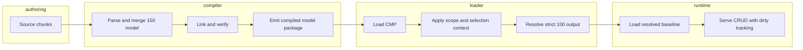
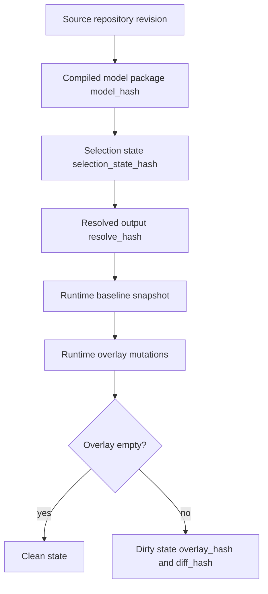

# ConfigFlux Canonical Model Specification

This document defines the complete ConfigFlux data model across all three applications:
- Configuration Compiler
- Model Parser/Loader
- Target Runtime Daemon (deferred)

It is the single source of truth for model layers, identities, hashes, and lifecycle transitions.

## 1) Scope
- Define the end-to-end model from 150% authoring data to runtime state.
- Define canonical IDs, path addressing, hash semantics, and invariants.
- Keep contracts transport-neutral (CLI, library, RPC wrappers can map to the same model).

Out of scope:
- Protocol-level daemon transport details.
- UI/UX specifics for commissioning tools.

## 2) End-to-End Architecture Model


## 3) Model Layers
| Layer | Owner App | Canonical Artifact | Persistence |
|---|---|---|---|
| Source chunks (150%) | Compiler | TOML files (today) | Repository |
| Merged in-memory model (150%) | Compiler | `schema::Config` | Process memory |
| Compiled model package | Compiler | `index.cfir.json` + `chunk-<hash>.cfir` | Filesystem/object storage |
| Selection state | Parser/Loader | `selection_state` (canonical stateless payload) | Caller payload and optional local session |
| Resolved output (100%) | Parser/Loader | strict resolved payload + metadata envelope | Filesystem/object storage |
| Runtime baseline snapshot | Runtime daemon | immutable loaded resolved state | Target persistent storage |
| Runtime mutable overlay | Runtime daemon | local writes delta over baseline | Target persistent storage |

## 4) Canonical Identity and Addressing Model

### 4.1 ID Rules
- `definition_id`, `component_id`, `param_key`, `artifact_id` are snake_case.
- IDs are globally unique in their namespace.
- Cross-reference targets must exist at verification time.

### 4.2 Cross-Stage Hashes
- `chunk_hash`: sha256 of canonicalized source chunk content.
- `model_hash`: canonical hash identity of the compiled model package (`IrIndex.config_hash`).
- `selection_state_hash`: hash of canonicalized selection state.
- `resolve_hash`: hash identity for one resolved output (`model_hash + scope + context + resolved payload`).
- `overlay_hash`: hash of local mutable runtime overlay.
- `diff_hash`: hash of normalized baseline-vs-overlay diff.

### 4.3 Canonical Runtime Paths
- Parameter path: `component.<component_id>.param.<param_key>`
- Artifact path: `artifact.<artifact_id>.<field>`
- Metadata path: `meta.<key>`

Grammar (informative):
```text
path := component_path | artifact_path | meta_path
component_path := "component." component_id ".param." param_key
artifact_path := "artifact." artifact_id "." field
meta_path := "meta." key
```

## 5) Authoring Model (150%)

Current canonical source model (from `compiler/src/schema.rs`):

```text
Config150
- package: string
- version: string
- definitions: map<definition_id, Parameter150>
- components: map<component_id, Component150>
- artifacts: map<artifact_id, Artifact150>

Component150
- type?: string
- condition?: string
- depends_on: list<component_id>
- params: map<param_key, Parameter150>

Parameter150
- inherits?: definition_id
- type?: string
- unit?: string
- doc?: string
- value?: Value
- lifecycle?: {construction | startup | runtime}
- safety?: {qm | sil1 | sil2 | sil3 | sil4}
- access?: {developer | integrator | technician | supervisor | super_user}
- limits?: Limits
- req_id?: string
- overrides: list<ConditionalBlock>

ConditionalBlock
- condition: string
- payload: Parameter150

Artifact150
- name: string
- version?: string
- hash?: string
- source?: string
- target?: string
- doc?: string
```

`Value` supports integer, float, boolean, and string.

## 6) Compile-Time Model (CMP)

Compiler output is a Compiled Model Package:
- `index.cfir.json`
- `chunk-<chunk_hash>.cfir` per source chunk

Canonical index model (from `compiler/src/ir.rs`):
```text
IrIndex
- format_version: u32
- chunks: list<{ chunk_hash, source_id }>
- component_index: map<component_id, chunk_hash>
- definition_index: map<definition_id, chunk_hash>
- artifact_index: map<artifact_id, chunk_hash>
- config_hash: string  // canonical model_hash
```

Canonical chunk model:
```text
IrChunk
- format_version: u32
- chunk_hash: string
- source_id: string
- definitions: map<definition_id, Parameter150>
- components: map<component_id, Component150>
- artifacts: map<artifact_id, Artifact150>
- metadata?: json
```

Required invariants:
- no duplicate IDs across chunks in the same namespace
- index references only known chunks
- chunk content and index mapping agree
- compile/link verification passes before package is considered valid

## 7) Selection Model (Parser/Loader)

Selection is canonicalized as a stateless payload; local stateful sessions are optional convenience.

```text
SelectionState
- schema_version: u32
- model_hash: string
- scope: string
- context_tags: map<string, string>
- choices: map<string, string>  // facet -> selected option
- selection_state_hash: string
```

Option query response shape:
```text
OptionSet
- schema_version: u32
- model_hash: string
- scope: string
- facet: string
- valid_options: list<string>
- pruned_options?: list<{ option: string, reason: string }>
- selection_state_hash: string
```

Rules:
- returned options must be valid under current constraints
- invalid options must not be returned as selectable
- same input state must produce same option set and same hashes

## 8) Resolved Model (100%)

Current strict resolved core (from `compiler/src/resolved_models.rs`):
```text
ResolvedConfigCore
- package: string
- version: string
- components: map<component_id, ResolvedComponent>

ResolvedComponent
- type: string
- params: map<param_key, ResolvedParameter>

ResolvedParameter
- value: Value
- type: string
- unit?: string
- safety: SafetyLevel
- lifecycle: Lifecycle
- access: Role
- req_id?: string
- doc?: string
- limits?: Limits
```

Cross-app resolved envelope (contract layer):
```text
ResolvedOutput
- schema_version: u32
- model_hash: string
- resolve_hash: string
- scope_root: string
- context_tags: map<string, string>
- resolved_core: ResolvedConfigCore
- artifact_bindings: list<{ path, artifact_id }>
- trace: { compiler_version?, generated_at?, diagnostics_ref? }
```

Software BOM relation:
- A software BOM is exported from `ResolvedOutput` and includes:
  - identity linkage (`model_hash`, `resolve_hash`, optional `selection_state_hash`)
  - resolved components/parameters
  - resolved artifact references and metadata
  - parameter binding phase derived from lifecycle:
    - `construction -> early`
    - `startup -> late`
    - `runtime -> runtime`
- Canonical schema is defined in `docs/software-bom-schema.md`.

## 9) Runtime State Model (Deferred)

Runtime daemon storage model (baseline + overlay):
```text
RuntimeState
- schema_version: u32
- snapshot_id: string
- baseline_resolve_hash: string
- baseline_model_hash: string
- baseline_data_ref: string
- overlay_entries: map<path, Value>
- overlay_hash: string
- diff_hash: string
- is_dirty: bool
```

Rules:
- baseline snapshot is immutable after load
- writes affect only overlay in v1
- `is_dirty` is true when normalized diff is non-empty
- writes must validate type/shape/constraints against model

## 10) Validation and Invariants by Stage
| Stage | Required Invariants |
|---|---|
| Ingestion | snake_case IDs/keys, parse validity |
| Link/Verify | reference integrity, dependency DAG, no diamonds, inheritance cycle checks, condition compatibility |
| Resolve | required component type, required parameter type/value, condition evaluation correctness, artifact parameter target exists |
| Runtime write (deferred) | canonical path validity, type/limits/unit validation, baseline+overlay consistency |

Verification severity policy:
- structural invalidity is an error (must fail verify)
- unreachable/dead branches are warnings (must not fail verify by themselves)

## 11) Lifecycle and State Transitions


## 12) Scale Envelope and Guardrails
- source repository scale target: up to about 20,000 config files
- resolved target scale: up to about 40,000 parameters
- thousands of valid combinations without precomputing all combinations

Implementation guardrails:
- no full cross-product materialization
- scoped closure loading by default
- deterministic hashes and outputs
- fail closed on conflicts and invalid writes
- no requirement for 128GB-class RAM hosts

## 13) Relationship to Other Docs
- Architecture and pipeline rationale: `docs/design.md`, `docs/plm-approach.md`
- Application boundary contracts: `docs/interface-contracts.md`
- Software BOM schema: `docs/software-bom-schema.md`
- Canonical worked example: `docs/canonical-worked-example.md`
