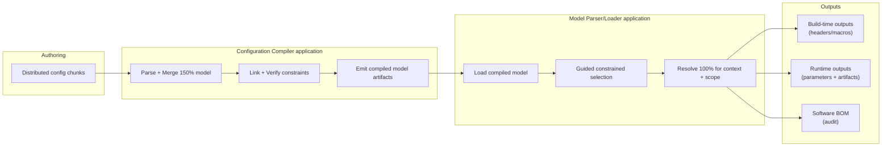

# ConfigFlux PLM Pipeline (150% -> 100% -> Consumable Outputs)

This document defines how ConfigFlux supports software product line engineering:
model many possible products (150%), select one concrete product context, and emit
auditable outputs (100%) for build-time or runtime consumption.

## Core Product Framing
- ConfigFlux is a Configuration Compiler, not a code compiler.
- Wrappers (for example C++ or ROS2) are integration layers, not the product core.
- The core product is:
  - model ingestion + constraint validation
  - deterministic 150% -> 100% resolution
  - outputs users can consume in build systems, commissioning, and runtime engines

## Two Usage Modes

### 1) Build-Time (Early Binding)
Use when teams compile code with product-specific values/artifacts.
- Input: product model + context/scope.
- Output examples:
  - generated headers (`config.hpp`)
  - macro definitions or compile-time constants
  - selected artifact references for packaging/linking

### 2) Commissioning / Production (Late Binding)
Use when technicians choose concrete product options during manufacturing/commissioning.
- This happens after the compiler stage as a separate application/stage.
- Typical execution locations: CI target-selection stage or technician PC tool.
- Selection UI/process applies model constraints and prunes invalid options.
- Example: selecting water cooling removes air-cooling-only options and incompatible parts.
- Final selection is resolved into a concrete 100% package for deployment.

## 100% Output Contract
A resolved product output must be auditable and consumable. It includes:
- Parameter configuration values.
- Artifact/blob references (files, libraries, images, other resources).
- Metadata required for traceability and compliance.
- Software BOM output that captures exactly what was selected/resolved.

Target runtime consumption direction (deferred implementation):
- A low-resource target daemon acts as the central configuration source.
- It loads resolved outputs and exposes CRUD operations to client systems.
- CRUD scope includes parameters, artifact references, and metadata.
- Write operations are validated against the compiled configuration model.
- Persistence across reboot is required; local-dirty state is tracked for later sync/promote flows.

## Pipeline

## Implementation Snapshot (Current)
- Implemented:
  - CUE-exported JSON chunk ingestion/merge.
  - Link/verify checks (including dependency and condition checks).
  - Scoped and full in-memory resolution APIs.
  - Artifact references in schema and artifact parameter validation.
  - Incremental IR chunk/index emission and integrity verification.
- Planned:
  - Stable CLI contracts for compile/resolve/emit.
  - Model Parser/Loader app for post-compile selection and resolution.
  - Generator backends (headers/macros, manifest, config DB).
  - Commissioning selection flow contract (input/output API).
  - Runtime configuration daemon for loading and serving parameter/artifact outputs.
  - First-class software BOM emitter.

## Documentation Next Steps
1) Lock a canonical output schema for 100% outputs and software BOM.
2) Define commissioning selection contract and constrained-choice behavior.
3) Define build-time generator contracts (`config.hpp`, macros, build flags).
4) Define target runtime daemon contract (loader, CRUD boundary, sync/promotion extension points).

Reference:
- Cross-application contract baseline is maintained in `docs/interface-contracts.md`.
- Canonical end-to-end data model is maintained in `docs/model-spec.md`.
- Canonical software BOM schema is maintained in `docs/software-bom-schema.md`.
- Canonical end-to-end worked example is maintained in `docs/canonical-worked-example.md`.
